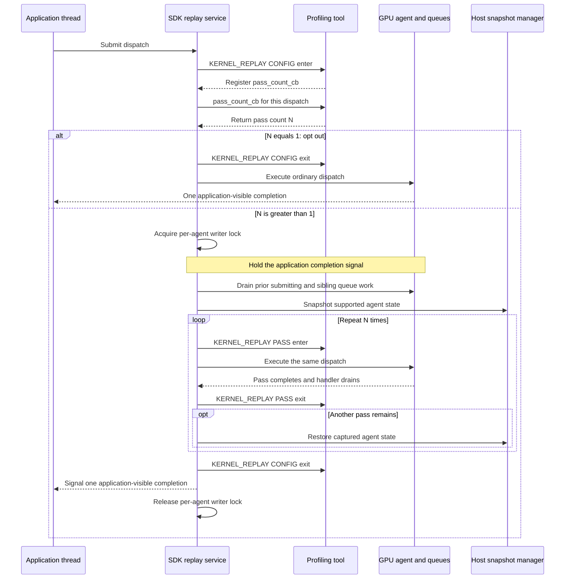
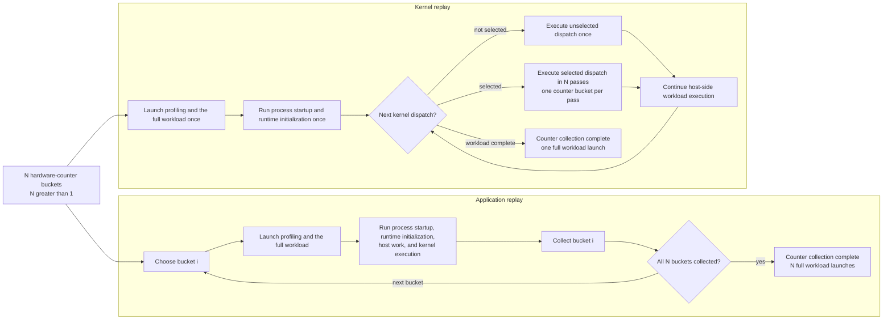
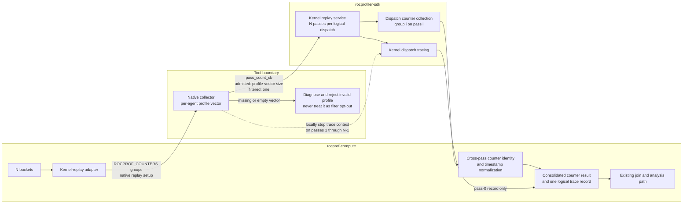

# Kernel replay in rocprof-compute

## System Context

### Counter collection today

`rocprof-compute` turns the metrics an analysis asks for into hardware counters, then packs those
counters into buckets — groups small enough to fit a single hardware pass. However many buckets fall
out of that packing is how many counter-collection passes the run needs.

`rocprof-compute` can preload its own **native collector**, which takes over counter collection
while tracing runs in a separate context. The native collector is unavailable in two cases: the
user declined it, or the installed ROCm predates the version that supports it.

Every configuration consumes the same buckets. Application replay works across all of them.
Iteration multiplexing already depends on the native collector and hard-errors without it. A
**logical dispatch** is one kernel launch as the application issued it, however many times a replay
strategy executes it.

| Strategy | Execution model | What it covers | What it does not cover |
| --- | --- | --- | --- |
| **Application replay** | Launch and run the complete workload once per bucket, then combine the collected counters. | Collects every bucket across corresponding replayed dispatch occurrences, without estimating missing counters from other occurrences. | Repeats process startup, runtime initialization, host work, and the workload itself. `rocprof-compute` rejects multi-bucket live attach, and communicating multi-rank workloads currently trigger a warning. |
| **Iteration multiplexing** | Launch the workload once for counter collection and let the native collector rotate buckets across different comparable dispatch occurrences. Analysis imputes the counters missing from each occurrence. | Avoids repeated application launches for workloads with enough dispatches. | Never collects every bucket from one logical dispatch. Undersampled kernels cannot produce a complete metric set, and iteration multiplexing needs the native collector. |

That leaves application replay as the only strategy today that can satisfy a multi-bucket request
without borrowing counters from neighbouring dispatches.

### Co-active profiling services

Counter collection never runs on its own. Every counter invocation has to produce kernel-dispatch
records, because those records carry the kernel counts and durations. Native collection splits the
work. The native collector owns counters; kernel dispatch tracing and marker or ROCTx tracing for a
framework-selected run happen in a separate tracing context. That split matters here — the trace
records come from a context the native collector can control but does not itself emit.

The native collector also subscribes to code-object tracing, but those events describe load-time
objects rather than individual dispatches, so kernel replay does not multiply them. PC sampling runs
in its own invocation.

### Proposed SDK replay mechanism

[ROCm PR 8622](https://github.com/ROCm/rocm-systems/pull/8622) proposes the SDK mechanism this
design has to consume. Treat it as a surrounding component and an external constraint: nothing here
proposes changes to its replay algorithm.

The PR adds a `KERNEL_REPLAY` callback domain with `CONFIG` and `PASS` operations. On the
fixed-pass path, a profiling tool supplies `pass_count_cb` during `CONFIG`. The SDK evaluates that
callback for each dispatch reaching the replay gate, and the callback can consult the dispatch's
agent information. Return `1` to opt out, and the SDK takes its ordinary single-execution path with
no snapshot and no `PASS` callbacks. Return anything greater than one and the SDK opens a replay
window, with `PASS` enter and exit callbacks delimiting each execution inside it.

The same upstream mechanism lets a tool locally stop a context for selected replay passes. Kernel
dispatch tracing honors that local stop and omits the disabled context's dispatch record — an
external capability the service-composition design below leans on.

A replay window isolates one GPU agent. The SDK takes a host-side writer lock keyed by that agent,
holds the application's completion signal, drains prior work on the submitting and sibling queues,
and copies the supported device state into a host snapshot. It then runs the dispatch once per
pass, restoring the snapshot between passes so every pass starts from identical device state.
Finally it exits `CONFIG`, signals a single application-visible completion, and releases the writer
lock.

The snapshot covers tracked, agent-owned, coarse-grained device allocations that are neither kernarg
nor executable memory. The SDK separately discovers and captures module-scope `__device__` and
`__constant__` storage visible to the agent. While a replay is active, ordinary dispatches take the reader
side of the same per-agent lock; replay windows on different agents still run concurrently.

## Problem statement

When a counter request produces *N* hardware-pass buckets and *N* is greater than one, application
replay launches and runs the complete workload once per bucket. Process startup, runtime
initialization, host-side work, and the kernel run all repeat *N* times, even though only the kernel
actually needs profiling *N* times. For workloads with a large startup cost, that is a lot of wasted
wall-clock.

Iteration multiplexing avoids the repeated launches, but it pulls counters from different dispatches
and fills in each dispatch's gaps during analysis. It does not answer the need to collect every
counter from repeated executions of one logical dispatch inside a single workload run.

Kernel replay is meant to close that gap. It keeps the same *N* buckets, runs the workload once, and
executes each replay-eligible dispatch *N* times, collecting one bucket per pass.

Replay also multiplies the co-active per-dispatch services. Left alone, kernel dispatch tracing would
emit *N* records for one logical dispatch, and Top Stats would report an inflated dispatch count and
aggregate GPU duration.

None of this is free. Kernel replay drops the repeated full-workload launches but adds snapshot,
restoration, dispatch replay, and isolation costs, so it will not be faster for every workload.

The flow below compares counter collection when *N* is greater than one. It leaves out profiler
invocations outside counter collection.

## Requirements

### Functional requirements

- `rocprof-compute profile` shall expose `--replay-mode {application,kernel}`, default to
  `application`, and require explicit selection of kernel replay. `--iteration-multiplexing` and its
  policy argument shall remain independent.
- For *N* counter buckets, kernel-replay mode shall use one workload invocation for counter
  collection and collect one bucket in each of *N* passes for every replay-eligible dispatch. Kernel
  replay shall not require a user-supplied pass count.
- Kernel replay shall require the native collector. The `rocprofv3` backend and `--no-native-tool`
  are unsupported configurations. The user may decline the native collector, or the installed ROCm
  may not support it. In either case, kernel replay shall produce a hard error naming the unmet
  condition before any workload runs.
- Kernel replay shall preserve the counter bucket membership used by application replay. The pass
  count shall equal the bucket count, every bucket shall fit one hardware pass, and `_ACCUM`
  pairing, TCC grouping, and same-bucket priority shall remain unchanged.
- One kernel-replay invocation shall produce a consolidated `results_*.csv` artifact that the
  existing workload join and analysis path can consume without an analysis-side contract change.
- All passes of one logical dispatch shall resolve to one `Dispatch_ID` group holding the complete
  counter set. Start and end timestamps shall follow the same cross-pass normalization semantics used
  for application-replay results.
- Kernel replay combined with `--iteration-multiplexing`, `--attach-pid`, or `--pc-sampling` shall
  produce a hard error. `--roof-only`, `--set`, and `--block` shall continue to interoperate
  unchanged.
- Kernel replay shall produce a hard error when the installed SDK predates the supported version
  floor, and shall state the required version.
- Kernel replay shall remain available for multi-rank workloads.
- If the SDK declines a device-memory snapshot, `rocprof-compute` shall abandon the profile without
  retry and recommend application replay in the diagnostic.
- If the upstream replay mechanism aborts, `rocprof-compute` shall report the failed run without
  attempting recovery.
- If an agent has no usable counter profiles, `rocprof-compute` shall diagnose the condition rather
  than silently degrading that dispatch to one pass.
- Kernel replay shall expose one kernel-dispatch trace record per logical dispatch, so Top Stats and
  `pmc_dispatch_info.csv` keep their non-replay semantics: one dispatch and its pass-0 logical
  duration, not replay-multiplied values.
- Kernel filtering shall compose with kernel replay. A dispatch whose kernel is excluded shall not be
  replayed and shall incur no snapshot or restore.
- Dispatch filtering shall compose with kernel replay. `--dispatch` indices shall count logical
  dispatches, not replay passes, so an index selects the same work whether or not kernel replay is
  selected. An excluded dispatch shall not be replayed.

### Non-functional requirements

- For state covered by the replay-equivalence guarantee, a counter present in more than one bucket
  shall have the same value across passes of the same dispatch. Cache-sensitive counters fall outside
  this invariant, because cache state is not restored.
- Kernel replay shall fail closed whenever it cannot deliver a complete bucket set. Kernel replay
  shall not collect partial counter data silently.
- Kernel replay shall guarantee equivalent replay state only for tracked coarse-grained VRAM and
  module-scope device or constant state. It shall make no equivalence guarantee for unified, managed,
  or `hipMallocAsync` memory, HIP graphs, multi-packet or multi-dispatch submissions, unfenced
  asynchronous SDMA copies, or cache state. It may also require host memory equal to the tracked
  device footprint.
- Workflows that do not select kernel replay shall keep their current collection behavior, and
  kernel-replay output shall preserve the existing analysis input contract.
- Diagnostics shall identify the selected replay mode, the bucket-to-pass mapping, and the specific
  failure condition.

## Design

### Counter groups and the collector boundary

Kernel replay changes the shape of the invocation, not how counters are partitioned.
`perfmon_coalesce` stays the single authority on bucket membership and one-pass fit. Its `_ACCUM`
pairing, TCC grouping, and same-bucket priority policies produce the same *N* buckets for both
application and kernel replay, and the kernel-replay adapter hands those buckets to the native
collector without regrouping them.

All *N* counter groups go to a single replay-enabled invocation, and the native collector derives the
pass count from the per-agent profiles it built from them. There is no separate pass-count option or
environment value, which is what keeps the bucket count and the pass count from ever disagreeing.

### Pass-count ownership and profile validity

Counter-group parsing creates one profile-vector entry per group, per agent. For an admitted
dispatch, `pass_count_cb` returns the size of the vector belonging to that dispatch's agent, and
replay pass *i* selects entry *i* from the same vector.

A return value of one carries a specific meaning: "do not replay." It is not a safe fallback when an
agent lookup fails or its vector turns out to be empty. Using it that way would execute the dispatch
once, collect a single bucket, and present incomplete data as a success. On a missing or empty
vector, the collector has to diagnose the agent/profile mismatch and fail the whole profile instead.

The component diagram shows both counter and kernel-trace data, and where each one crosses the
collector boundary.

### Filtering at the pass-count decision

`pass_count_cb` doubles as the filter decision point, because it runs exactly once per logical
dispatch and before any replay pass. Before picking a count, the collector confirms the dispatch's
agent has a non-empty profile vector. It then assigns the dispatch's per-kernel logical index, once
and only here. Next it evaluates two filters: the kernel-ID target set built during code-object
loading, and the requested dispatch range. It returns the profile-vector size only if both filters
admit the dispatch. A confirmed filter miss returns one, deliberately choosing the SDK's ordinary path with no
snapshot and no restore. A missing or empty profile vector stays a fatal profile error and must never
borrow that return value.

The per-pass counter-dispatch callback reads the assigned logical index rather than incrementing it.
A non-replay run has one pass per dispatch, so moving the increment keeps existing indices intact
while stopping replay passes from consuming extra ones. Completeness checks apply only to admitted
dispatches: a dispatch excluded on purpose produces no counter set, and that is not an incomplete
replay result.

### Output and dispatch identity

One kernel-replay counter invocation produces one consolidated `results_*.csv` artifact.

Before that artifact is written, every pass row for a logical dispatch has to receive one
`Dispatch_ID` and one canonical start/end timestamp pair. Pass identity may survive transiently for
normalization and diagnostics, but it does not need to reach `pmc_perf.csv`.
Non-replay identity behavior is untouched.

Application replay lines up corresponding dispatches because each workload invocation restarts
positional ID assignment from scratch, even though the timestamps differ between runs — it never
literally rewrites timestamps. Kernel replay needs the same alignment, but inside a single
invocation: correlate the pass rows using replay-stable logical-dispatch identity first, then
normalize their timestamp pair before the existing identity and pivot contracts see them.

Skip that step and the current timestamp-bearing identity key hands every pass its own
`Dispatch_ID`. Analysis groups on `Dispatch_ID` before pivoting counter names into columns, so each
group would hold a single bucket and no row would carry the complete metric inputs.

### Co-active service composition

Kernel dispatch tracing has to yield one record per logical dispatch regardless of pass count, so
Top Stats and `pmc_dispatch_info.csv` report the same dispatch count and duration they would without
replay.

Because the native collector owns its SDK contexts, it can suppress the duplicate records at the
source instead of cleaning them up afterwards. It traces pass 0 and locally stops the kernel-trace
context for passes 1 through *N*−1. The collector picks pass 0 because it is the only pass running
against pristine pre-snapshot state. Every later pass starts immediately after a full restore of the tracked
footprint, so its timing says more about replay overhead than about the dispatch.

Suppressing at the source is what makes this both cheap and exact. Nothing has to reconstruct which
records belonged to the same logical dispatch, because the extra records never exist.

Roofline picks up the selected replay mode through the ordinary counter path and needs no special
handling. Code-object tracing is load-time only, so replay does not touch it. Marker and ROCTx
regions are emitted once on the host but span every pass, and their duration semantics are still
open.

### Mode and option compatibility

`--replay-mode` accepts `application` and `kernel`. Application replay stays the default, and CLI
help flags kernel replay as experimental. `rocprof-compute` carries the selected mode down to the
kernel-replay adapter. This does not turn `--iteration-multiplexing` into a mode selector.

Kernel mode needs the native collector, and the conditions that supply one do not all become
knowable at the same moment. So rejection happens in two places:

- **Flag conflict**, decidable from the arguments alone: kernel replay selected while the native
  collector is declined. `rocprof-compute` rejects this immediately, before any discovery and before
  it creates the workload directory.
- **Capability failure**, decidable only once discovery has resolved the ROCm version and the
  native library: an unsupported ROCm version, or a library that cannot be resolved.
  `rocprof-compute` rejects this later, but still before the workload runs.

Both are hard errors. The split matters: a capability failure leaves a workload directory behind,
whereas a flag conflict leaves nothing.

`rocprof-compute` likewise rejects kernel mode before profiling when it appears alongside iteration
multiplexing, live attach, or PC sampling. Kernel replay rejects iteration multiplexing because both
strategies claim the same per-dispatch passes, not because of any backend restriction — iteration
multiplexing needs the native collector too. PC
sampling is agent-wide, does not consume the localized context override, and today runs in a separate
counter-disabled invocation, so there is no supported replay pass to insert it into.

`--roof-only`, `--set`, and `--block` continue through ordinary counter selection. Multi-rank
profiling stays available and keeps its warning. Kernel replay also needs a supported SDK version
and a homogeneous agent configuration. Whether kernel replay has to exclude collective-bearing
dispatches is still an open question.

### Failure behavior

Every failure below rejects partial replay data. None of them falls back to application replay, and
none quietly turns a multi-bucket request into a single pass.

| Condition | Required behavior |
| --- | --- |
| Native collector declined while kernel replay is selected | Hard error from the argument combination alone, before discovery. |
| Native collector unavailable: unsupported ROCm version or unresolvable library | Hard error after discovery, naming which of the two conditions failed. |
| SDK below the supported version floor | Hard error stating the required version. This is distinct from the ROCm version the native collector needs, so the diagnostic has to say which one is unmet. The numeric floor is pending upstream merge. |
| Iteration multiplexing, live attach, or PC sampling selected with kernel replay | Hard error before profiling starts. |
| Missing or empty per-agent profile vector | Diagnose the agent/profile mismatch and reject the profile; never return one as a fallback. |
| SDK declines the device-memory snapshot | Abandon the entire profile without retry, reject incomplete output, and recommend application replay. |
| Upstream drain timeout or process abort | Abort the failed run without recovery. |

One wrinkle: a declined snapshot can currently leave a successful process status behind, so the
required outcome cannot lean on subprocess failure alone. Classifying an upstream warning string is
the signal available today, and it is a fragile one. A structured detection mechanism remains an open
question.

### Support boundaries and rationale

Kernel replay inherits the upstream mechanism's support boundaries:

- The host snapshot requires at least as much memory as the complete tracked device footprint.
- Equivalent-state guarantees cover tracked coarse-grained device VRAM and module-scope
  `__device__` or `__constant__` state. Unified, managed, and `hipMallocAsync` allocations are not
  restored.
- HIP graph launches are unsupported.
- Only single-packet, single-dispatch submissions are replayed; anything else executes without
  replay.
- Asynchronous SDMA or HSA copies are not fenced by the replay window.
- Cache state is not restored, so cache-sensitive counter values may vary between passes.
- Bounded drain expiry aborts the process rather than returning a recoverable error.
- Multi-rank dispatches taking part in collectives remain unsafe until there is an exclusion policy.

## Implementation phases

Proposed vertical slices for the implementation work ahead:

- **Mode selection and validation.** Add the experimental `--replay-mode {application,kernel}`
   surface, carry the selected mode through the profiling path, and implement both rejection layers
   with their hard-error diagnostics. Replay execution stays disabled in this slice, so the only
   observable behavior is mode selection and correct rejection — existing application-replay output
   does not change.
- **Native-collector replay.** Deliver the coalesced counter groups to the SDK invocation, and
   implement `pass_count_cb` from the per-agent profile-vector size. Apply the kernel and dispatch
   filters at that same decision point, and diagnose a missing or empty vector instead of returning
   one pass. Application replay keeps working throughout.
- **Consolidated output and dispatch identity.** Produce one consolidated `results_*.csv`, normalize
   cross-pass timestamps and identity so every pass of a logical dispatch resolves to one
   `Dispatch_ID`, and expose the single pass-0 trace record.

## Validation, security and debuggability

### Validation

Validation spans the CLI, the kernel-replay adapter, replay-profile construction, output
normalization, and the analysis boundary that should not have moved.

- **Counter accuracy.** For one logical dispatch, and for state covered by the equivalence guarantee,
  a counter present in more than one bucket must report the same value in every pass. A mismatch is a
  validation failure. Evaluate cache-sensitive counters separately, as a documented limitation.
- **Completeness and identity.** For each dispatch admitted by the replay filters, the observed pass
  count must equal the application replay count, every bucket must appear exactly once, and all pass
  rows must collapse into one complete `Dispatch_ID`. Incomplete results have to fail before
  analysis.
- **Filtering.** Logical indices must advance once per dispatch, not once per pass. A confirmed
  filter exclusion must take the ordinary no-snapshot path. Kernel replay must not misread it as a
  missing-profile failure or an incomplete replay result.
- **Application-replay comparison.** Profile the same deterministic workload and counter request in
  both modes, then compare bucket membership, counter completeness, and final analysis results.
  Existing application replay must come out unchanged.
- **Service composition.** Kernel replay must expose one pass-0 trace record and one non-multiplied
  logical duration per dispatch.
- **Compatibility.** Cover the accepted options and every rejected combination: iteration
  multiplexing, live attach, PC sampling, roofline selection, the multi-rank warning, and the
  default-off behavior.
- **Configuration rejection.** Cover each unmet native-collector condition on its own — declined
  native collector, unsupported ROCm version, unresolvable library. Each must fail before profiling
  starts, with a diagnostic naming that specific condition.
- **Failure paths.** Cover an unsupported SDK, a missing profile vector, a declined snapshot, and an
  upstream abort. Each case has to prove no one-pass fallback happened.

### Security

Kernel replay adds no network interface and no new privilege boundary. Its one security-sensitive
operation is the SDK-managed host snapshot of application device memory. That snapshot can hold
application data and can consume host memory comparable to the tracked footprint. It stays inside the
profiled process's trust boundary, and `rocprof-compute` must never persist its contents in result
artifacts or print them in diagnostics. Snapshot allocation and restore failures are availability
failures, and they follow the same fail-closed rule as every other incomplete replay condition.

### Debuggability

Run diagnostics have to identify the selected replay mode and backend, SDK capability, agent, and the
mapping from every counter bucket to its replay pass. They also have to tell apart option conflicts,
unavailable native collection, missing profiles, snapshot decline, and upstream abort — and say
plainly that partial results are unusable. A snapshot-decline diagnostic also recommends
application replay.

A configuration diagnostic has to name the specific unmet condition instead of reporting that the
native collector is unavailable. One message covering both an unsupported ROCm version and an
unresolvable library leaves the user with no action to take, because the remedy is different in
each case.

## Open questions

- **Collective-bearing kernels.** Should kernel replay exclude dispatches taking part in
   inter-process collectives?
- **Marker and ROCTx semantics.** The host emits these regions once, but they span every replay
   pass, so their durations include replay overhead and are not comparable with a non-replay run.
   Reject the combination, or correct the duration?
- **Cache-related counter validity.** Are cache-related metrics trustworthy at all, when nothing
   restores cache state between replay passes?
