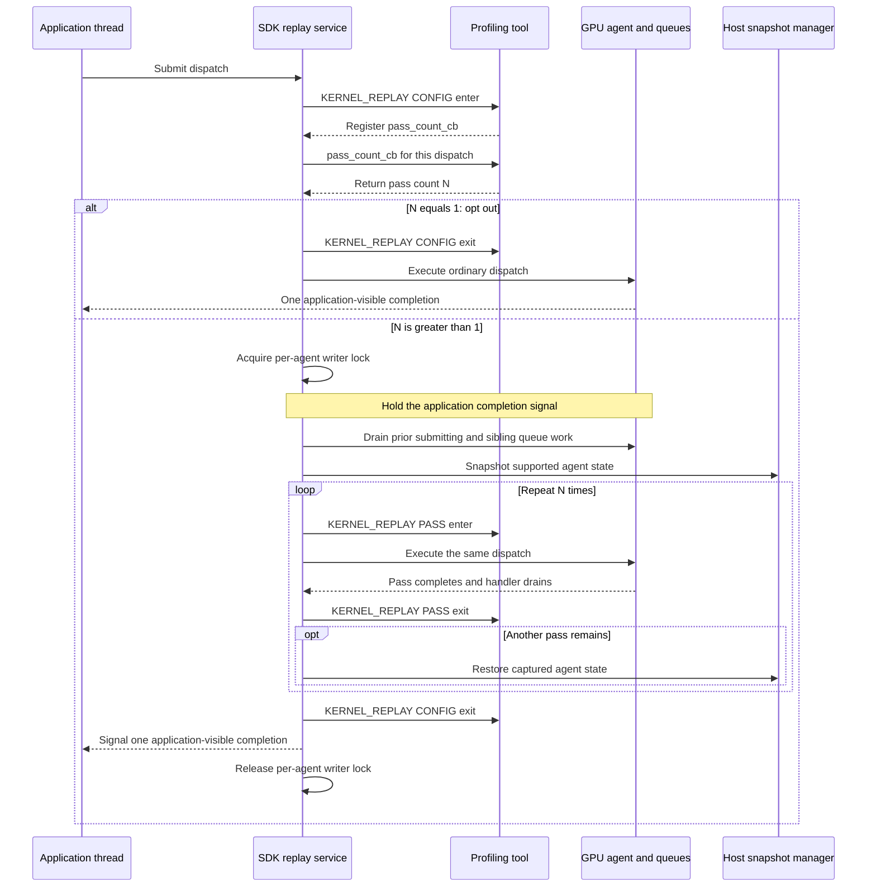
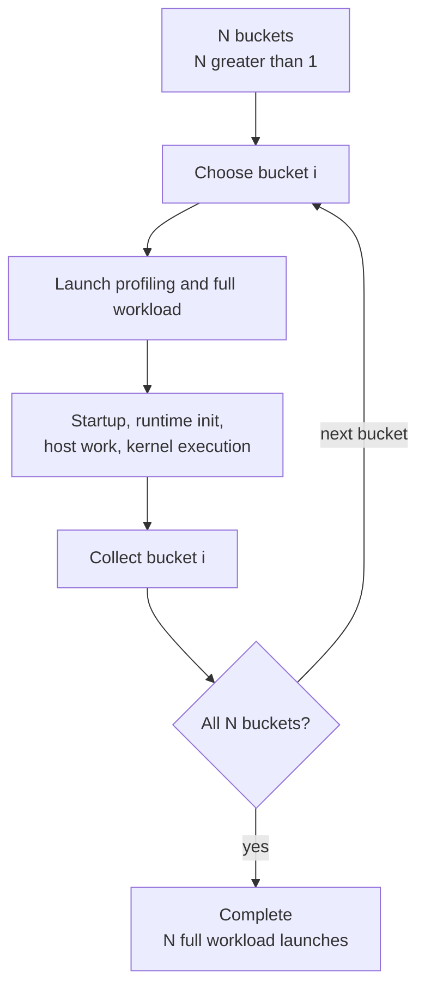
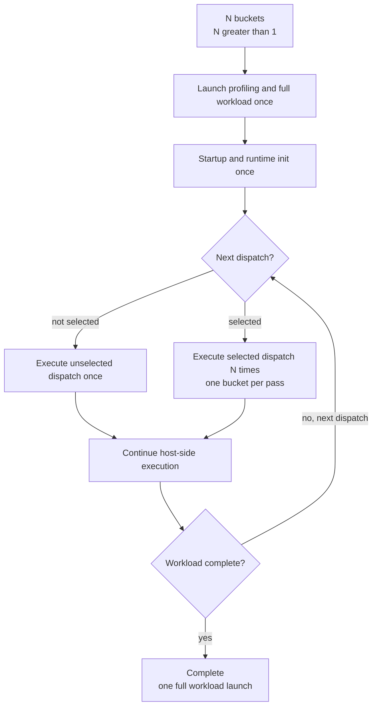
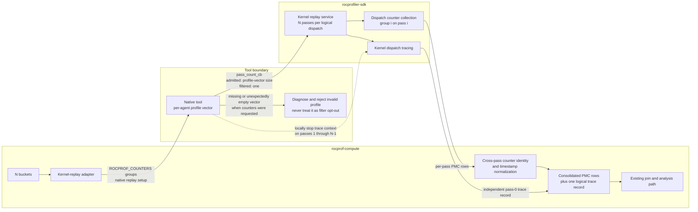
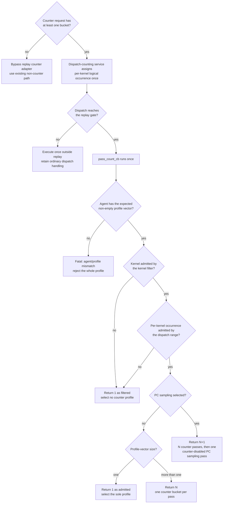

# Kernel replay in rocprof-compute

## System Context

### Terms

| Term | Meaning |
| --- | --- |
| **Bucket** | A group of hardware counters small enough to fit one hardware pass. |
| **Logical dispatch** | One kernel launch as the application issued it, however many times a replay strategy executes it. |
| **Native tool** | A `rocprof-compute` library. |

### Counter collection today

| Strategy | Execution model | Pros | Cons |
| --- | --- | --- | --- |
| **Application replay** | Launch and run the complete workload once per bucket. | Every bucket, across corresponding replayed dispatch occurrences — nothing is estimated from other occurrences. | Repeats process startup, runtime initialization and host work. |
| **Iteration multiplexing** | Launch once and let the native tool rotate buckets across comparable dispatches. Analysis imputes each dispatch's missing counters. | Avoids repeated launches for workloads with enough dispatches. | Never collects every bucket from one logical dispatch. Undersampled kernels cannot produce a complete metric set. |

- Every configuration consumes the same buckets. Application replay works across all of them;
  iteration multiplexing hard-errors without the native tool.
- Application replay is therefore the only strategy today that satisfies a multi-bucket request
  without borrowing counters from neighbouring dispatches.

### Co-active profiling services

Counter collection never runs alone. Every counter collection invocation must produce kernel-dispatch records,
because those records carry the kernel records.

| Service | Context owner | Per dispatch? | Consequence under replay |
| --- | --- | --- | --- |
| Kernel dispatch tracing | Separate tracing context | Yes | *N* records for one logical dispatch. |
| Marker / ROCTx tracing | Separate tracing context | Host-side, spans all passes | Region duration absorbs replay overhead. |
| Code-object tracing | Native tool | No | Unaffected |
| PC sampling | Own invocation today | Agent-wide | Becomes its own replay pass. |
| Counter collection | Native tool | Yes | The point of the feature: one bucket per pass. |

### Proposed SDK replay mechanism

[ROCm PR 8622](https://github.com/ROCm/rocm-systems/pull/8622) proposes the SDK mechanism that this design
relies on.

| Domain / operation | SDK | Profiling tool |
| --- | --- | --- |
| `KERNEL_REPLAY` `CONFIG` enter | Once per dispatch reaching the replay gate | Supply `pass_count_cb` (fixed-pass path). |
| `pass_count_cb` | Once per dispatch, before any pass | Return the pass count. May consult the dispatch's agent information. |
| `KERNEL_REPLAY` `PASS` enter / exit | Delimits each execution inside a replay window | Select the counter profile for this pass. |
| `KERNEL_REPLAY` `CONFIG` exit | After the last pass | — |

| `pass_count_cb` returns | SDK behavior |
| --- | --- |
| `1` | Ordinary single-execution path. No replay window, no snapshot, no `PASS` callbacks. |
| Greater than `1` | Opens a replay window with that many passes. |

SDK also lets a profiling tool locally stop a context for selected replay passes.

- **Snapshot coverage.** Tracked, agent-owned, coarse-grained device allocations that are neither
  kernarg nor executable memory. The SDK separately discovers and captures module-scope `__device__`
  and `__constant__` storage visible to the agent.
- **Isolation.** A replay window isolates a GPU agent.
- **Restoration.** The snapshot is restored between passes, so every pass starts from identical
  device state.

## Problem statement

When a counter request produces *N* buckets and *N* is greater than one:

| Per counter-collection run | Application replay | Kernel replay |
| --- | --- | --- |
| Workload launches | *N* | 1 |
| Process startup, runtime initialization | *N*× | 1× |
| Host-side work | *N*× | 1× |
| Executions of a replay-eligible dispatch | *N* (one per launch) | *N* (one per pass) |
| Executions of every other dispatch | *N* | 1 |
| Added cost | — | Snapshot, restore, queue drain, agent isolation |

Only the selected kernel needs profiling *N* times. For workloads with a large startup cost,
application replay requires a lot of time.

- **Iteration multiplexing does not close this gap.** It avoids the repeated launches, but collects
  counters from different dispatches and fills each dispatch's gaps during analysis. It cannot
  collect every counter from repeated executions of *one* logical dispatch in a single workload run.
- **This is not free.** Kernel replay drops the repeated full-workload launches but adds snapshot,
  restoration, dispatch replay, and isolation costs. It will not be faster for every workload.

The flows below compares counter collection when *N* is greater than one. It does not include other
services outside counter collection.

### Application replay

### Kernel replay

## Requirements

### Functional requirements

#### Mode selection

| ID | Requirement |
| --- | --- |
| **FR-1** | `rocprof-compute profile` exposes `--replay-mode {application,kernel}`, defaults to `application`. `--iteration-multiplexing` stay independent. |
| **FR-2** | For *N* buckets, kernel mode uses one workload invocation for counter collection and collects one bucket in each of *N* passes, for every replay-eligible dispatch. No user-supplied pass count. A zero-bucket request bypasses the kernel-replay counter adapter and retains the existing non-counter path, including the PC-sampling-only path. |
| **FR-3** | Kernel replay requires the native tool. The `rocprofv3` backend and `--no-native-tool` are unsupported. A declined native tool, or a ROCm version that does not support one, is a hard error naming the unmet condition, before any workload runs. |

#### Passes and buckets

| ID | Requirement |
| --- | --- |
| **FR-4** | Bucket membership matches application replay. `_ACCUM` pairing, TCC grouping, and same-bucket priority are unchanged, and every bucket still fits one hardware pass. |
| **FR-5** | Pass count equals the bucket count, or the bucket count plus one when `--pc-sampling` is selected. |
| **FR-6** | The PC sampling pass runs with counter collection disabled, and alters neither bucket membership nor the ordering of the counter passes preceding it. |

#### Output and identity

| ID | Requirement |
| --- | --- |
| **FR-7** | One kernel-replay invocation produces one consolidated counter result using the existing naming and discovery convention, which the workload join and analysis path consume with no analysis-side contract change. |
| **FR-8** | All passes of one logical dispatch resolve to one `Dispatch_ID` group holding the complete counter set. |
| **FR-9** | Start and end timestamps follow the same cross-pass normalization semantics used for application-replay results. |
| **FR-10** | Preserve two independent one-dispatch contracts: suppress kernel-dispatch tracing after pass 0 so exactly one trace record remains, and consolidate the normalized counter rows into one logical dispatch with its pass-0 duration before analysis. Top Stats and the dispatch information output consume the latter counter data, not the trace stream. |

#### Composition and filtering

| ID | Requirement |
| --- | --- |
| **FR-11** | Kernel replay with `--iteration-multiplexing` or `--attach-pid` is a hard error. `--roof-only`, `--set`, and `--block` interoperate unchanged. |
| **FR-12** | Kernel filtering composes. A dispatch whose kernel is excluded is not replayed and incurs no snapshot or restore. |
| **FR-13** | Dispatch filtering composes. `--dispatch` retains its 1-based, per-kernel logical-occurrence semantics: indices count each kernel's logical dispatches, not replay passes or a global dispatch sequence. Replay-ineligible submissions still advance the existing per-kernel occurrence counter when the dispatch-counting service observes them, and an excluded dispatch is not replayed. |
| **FR-14** | Kernel replay stays available for multi-rank workloads and emits a kernel-replay-specific diagnostic describing the unresolved risk that one rank may replay a collective-bearing dispatch while its peers do not. It does not reuse the application-replay warning about repeated workload launches or recommend iteration multiplexing. |

#### Failure

| ID | Requirement |
| --- | --- |
| **FR-15** | An SDK below the supported version floor is a hard error stating the required version. |
| **FR-16** | If the SDK declines a device-memory snapshot, abandon the profile without retry and recommend application replay in the diagnostic. |
| **FR-17** | If the upstream replay mechanism aborts, report the failed run without attempting recovery. |
| **FR-18** | If counters were requested but an agent has no usable counter profiles, diagnose the condition rather than silently degrading that dispatch to one pass. A request that resolves to zero counter buckets bypasses the replay counter adapter under FR-2 and is not this failure. |

### Non-functional requirements

| ID | Requirement |
| --- | --- |
| **NFR-1** | For deterministic workloads and state covered by the replay-equivalence guarantee, each kernel-replay bucket matches the corresponding application-replay bucket for the same logical dispatch. Cache-sensitive counters fall outside this invariant. |
| **NFR-2** | Fail closed whenever a complete bucket set cannot be delivered. Never collect partial counter data silently. |
| **NFR-3** | Guarantee equivalent replay state only for tracked coarse-grained VRAM and module-scope device or constant state. No guarantee for unified, managed, or `hipMallocAsync` memory, HIP graphs, multi-packet or multi-dispatch submissions, unfenced asynchronous SDMA copies, or cache state. May require host memory equal to the tracked device footprint. |
| **NFR-4** | Workflows that do not select kernel replay keep their current collection behavior, and kernel-replay output preserves the existing analysis input contract. |
| **NFR-5** | Diagnostics identify the selected replay mode, the bucket-to-pass mapping, and the specific failure condition. |

## Design

### Counter groups and the native-tool boundary

- **The counter-grouping logic stays the single authority** on bucket membership and one-pass fit. Its
  `_ACCUM` pairing, TCC grouping, and same-bucket priority policies produce the same *N* buckets for
  both modes, and the kernel-replay adapter hands those buckets to the native tool without
  regrouping them.
- **All *N* groups go to a single replay-enabled invocation.** The native tool derives the pass
  count from the per-agent profiles it built from them, adding one when PC sampling is selected. The
  existing multi-group admission check, which recognizes iteration multiplexing today, must also
  admit kernel replay as a separate condition. Every other unsupported multi-group input keeps
  hard-erroring, and kernel replay remains mutually exclusive with iteration multiplexing.
- **Consolidated results keep the existing naming convention.** Deterministic bucket ordering keeps
  the naming input stable, so existing result discovery needs no mode-specific branch.
- **No separate pass-count option or environment value exists.** Deriving the count from the buckets
  is what stops the two from drifting apart. A request with zero buckets bypasses this adapter and
  follows the existing non-counter path.

### The pass-count decision

Counter-group parsing creates one profile-vector entry per group, per agent. Before replay setup, a
zero-bucket request bypasses the replay counter adapter and follows the existing non-counter path.
For a counter request, `pass_count_cb` is the single decision point for admission and pass count,
because it runs exactly once for each dispatch that reaches the replay gate and before any replay
pass. It consults the existing 1-based, per-kernel logical-occurrence index; it does not create a
second replay-only index sequence.

| Returns | When | What the execution selects |
| --- | --- | --- |
| `1` — filtered | A confirmed filter miss — the kernel or its per-kernel logical occurrence is excluded. | Nothing. The SDK takes its ordinary path, deliberately paying no snapshot or restore. |
| `1` — admitted | The dispatch is admitted and its agent's profile vector contains exactly one bucket. | The ordinary execution selects the sole profile. This is a complete one-bucket result, not a filter outcome. |
| *N*, where *N* > 1 | Admitted, no PC sampling. *N* is the size of the profile vector for this dispatch's agent. | Pass *i* selects entry *i* of that vector. |
| *N*+1 | Admitted, PC sampling selected. *N* is the non-zero size of the profile vector. | Passes 0 through *N*−1 map one-to-one onto the vector. Pass *N* selects no counter profile and runs counter-disabled. |
| *(fatal)* | Counters were requested, but the agent is missing or its expected profile vector is empty. | Nothing. Diagnose the agent/profile mismatch and fail the whole profile. |

Three consequences worth stating plainly:

- **Admission is state, not a numeric inference.** Both a filtered dispatch and an admitted
  single-bucket dispatch return `1`, but only the admitted case selects a profile and participates in
  completeness checking. The adapter records that distinction explicitly.
- **`1` is never a fallback for a missing expected profile.** Returning it for an agent/profile
  mismatch would execute the dispatch once, collect at most one bucket, and present incomplete data
  as a success.
- **The logical index remains owned by dispatch observation.** The dispatch-counting service advances
  the 1-based index once per logical occurrence of each kernel, including submissions the replay gate
  cannot replay. `pass_count_cb` only reads that stable index, and replay passes never consume another
  occurrence.

Completeness checks apply only to admitted dispatches. A dispatch excluded on purpose produces no
counter set, and that is not an incomplete replay result. A zero-bucket request bypasses the adapter
before dispatch admission, so it is likewise not a missing or incomplete replay result.

### Output and dispatch identity

One kernel-replay counter invocation produces one consolidated counter result. Before it is
written, every pass row for a logical dispatch must collapse to one identity.

| Step | What happens | If skipped |
| --- | --- | --- |
| 1. Correlate | Group the pass rows by replay-stable logical-dispatch identity. | Nothing ties the passes of one dispatch together. |
| 2. Normalize timestamps | Give the group one canonical start/end pair using pass 0's logical duration. | The timestamp-bearing identity key can hand every pass its own `Dispatch_ID`, and counter-derived duration summaries can retain replay-pass timing. |
| 3. Hand off | The existing identity and pivot contracts see one row set per dispatch. Top Stats and the dispatch information output are generated from this consolidated counter data. | Analysis pivots each single-bucket group separately, so no row carries the complete metric inputs; counter-derived dispatch counts and durations can also be multiplied. |

- Pass identity may survive transiently for normalization and diagnostics; it does not need to reach
  the counter result output. Non-replay identity behavior is untouched.
- Application replay achieves the same alignment differently: each workload invocation restarts
  positional ID assignment from scratch, even though timestamps differ between runs. It never
  literally rewrites timestamps. Kernel replay needs that alignment *inside* a single invocation.

### Co-active service composition

| Service or output | Under kernel replay | Mechanism |
| --- | --- | --- |
| Kernel dispatch tracing | One trace record per logical dispatch, from pass 0 | The native tool owns the context, so it locally stops kernel tracing for passes 1 through *N*−1. |
| Top Stats and dispatch information | One logical counter dispatch and its pass-0 duration | These outputs consume the consolidated counter data from Output and dispatch identity, not the kernel-dispatch trace stream. |
| Code-object tracing | Unchanged | Load-time only. Replay never multiplies it. |
| Marker / ROCTx | Emitted once, spans all passes | Duration semantics are an open question. |
| PC sampling | One extra pass, appended after the counter passes | Runs counter-disabled. |
| Roofline | Unchanged | Picks up the selected mode through the ordinary counter path. |

- **Why pass 0.** It is the only pass running against pristine pre-snapshot state. Every later pass
  starts immediately after a full restore of the tracked footprint, so its timing says more about
  replay overhead than about the dispatch.
- **Why suppress at the source.** Nothing has to reconstruct which trace records belonged to the same
  logical dispatch, because the extra records never exist. That makes trace suppression both cheap
  and exact. It is independent of counter-row consolidation: Top Stats and dispatch information remain
  correct only when the Output and dispatch identity path also collapses the counter rows.

### Mode and option compatibility

`--replay-mode` accepts `application` and `kernel`. Application replay stays the default, CLI help
flags kernel replay as experimental, and the selected mode travels down to the kernel-replay adapter.
This does not turn `--iteration-multiplexing` into a mode selector.

| Option or condition | With kernel replay | Reason |
| --- | --- | --- |
| `--iteration-multiplexing` | Rejected | Both strategies claim the same per-dispatch passes. Not a backend restriction — iteration multiplexing needs the native tool too. |
| `--attach-pid` | Rejected | Live attach cannot open a replay window over an already-running process. |
| `--no-native-tool`, `rocprofv3` backend | Rejected | Kernel replay needs the SDK contexts only the native tool owns. |
| `--pc-sampling` | Accepted, *N*+1 passes | Agent-wide, and it does not consume the localized context override. It takes a counter-disabled pass of its own. |
| `--roof-only`, `--set`, `--block` | Accepted, unchanged | Ordinary counter selection. |
| Multi-rank | Accepted, with a kernel-replay-specific diagnostic | Warn that replaying one rank's collective-bearing dispatch while peers do not may desynchronize the collective. Do not reuse the application-replay warning about multiple workload launches or recommend iteration multiplexing. Open Question 1 remains unresolved. |
| Heterogeneous agents | Rejected | Kernel replay needs a homogeneous agent configuration. |

Kernel mode needs the native tool, but the conditions that supply one do not all become
knowable at the same moment, so rejection happens in two layers:

| Layer | Decidable from | Rejected when | Workload directory left behind? |
| --- | --- | --- | --- |
| **Flag conflict** | The arguments alone | Kernel replay selected while the native tool is declined | No — rejected before discovery and before the directory is created |
| **Capability failure** | Discovery, once it has resolved the ROCm version and native library | Unsupported ROCm version, or a library that cannot be resolved | Yes — rejected later, but still before the workload runs |

Both are hard errors. Iteration multiplexing and live attach are likewise rejected before profiling
starts.

### Failure behavior

Every failure below rejects partial replay data. None falls back to application replay, and none
quietly turns a multi-bucket request into a single pass.

| Condition | Required behavior | Covers |
| --- | --- | --- |
| Native tool declined while kernel replay is selected | Hard error from the argument combination alone, before discovery. | FR-3 |
| Native tool unavailable: unsupported ROCm version or unresolvable library | Hard error after discovery, naming which of the two failed. | FR-3, NFR-5 |
| SDK below the supported version floor | Hard error stating the required version. Distinct from the ROCm version the native tool needs, so the diagnostic must say which one is unmet. The numeric floor is pending upstream merge. | FR-15 |
| Iteration multiplexing or live attach selected with kernel replay | Hard error before profiling starts. | FR-11 |
| Missing or unexpectedly empty per-agent profile vector when counters were requested | Diagnose the agent/profile mismatch and reject the profile. Never return `1` as a fallback. A zero-bucket request bypasses the replay adapter before this point and is not this failure. | FR-18, NFR-2 |
| SDK declines the device-memory snapshot | Abandon the entire profile without retry, reject incomplete output, and recommend application replay. | FR-16, NFR-2 |
| Upstream drain timeout or process abort | Abort the failed run without recovery. | FR-17 |

One wrinkle: a declined snapshot can currently leave a successful process status behind, so the
required outcome cannot lean on subprocess failure alone. Classifying an upstream warning string is
the signal available today, and it is a fragile one. A structured detection mechanism remains an
open question.

### Support boundaries and rationale

Kernel replay inherits the upstream mechanism's support boundaries.

| State or feature | Replay guarantee |
| --- | --- |
| Tracked coarse-grained device VRAM | Snapshotted and restored between passes. |
| Module-scope `__device__` / `__constant__` state | Discovered and captured by the SDK. |
| Unified, managed, `hipMallocAsync` allocations | Not restored. No equivalence guarantee. |
| Cache state | Not restored. Cache-sensitive counter values may vary between passes. |
| HIP graph launches | Unsupported. |
| Multi-packet or multi-dispatch submissions | Not replayed. Only single-packet, single-dispatch submissions are; anything else executes without replay. |
| Asynchronous SDMA or HSA copies | Not fenced by the replay window. |
| Host memory | Requires at least as much as the complete tracked device footprint. |
| Bounded drain expiry | Aborts the process rather than returning a recoverable error. |
| Multi-rank dispatches in collectives | Unsafe until there is an exclusion policy. |

## Implementation phases

| Phase | Delivers | Observable after this phase |
| --- | --- | --- |
| **1. Mode selection and validation** | The experimental `--replay-mode {application,kernel}` surface, the selected mode carried through the profiling path, and both rejection layers with their hard-error diagnostics. Replay execution stays disabled. | Mode selection and correct rejection. Existing application-replay output does not change. |
| **2. Native-tool replay** | Coalesced counter groups delivered to the SDK invocation; the multi-group admission check extended to admit kernel replay independently of iteration multiplexing; `pass_count_cb` implemented from the per-agent profile-vector size and explicit admission state; both filters applied from the existing per-kernel occurrence index; and diagnosed failure on a missing or unexpectedly empty vector when counters were requested. | Replayed dispatches collect every bucket in one run, including valid one-bucket requests, while zero-bucket requests retain the existing bypass. Application replay keeps working throughout. |
| **3. Consolidated output and dispatch identity** | One consolidated counter result using the existing naming convention, cross-pass timestamp and identity normalization for counter rows, and the independently suppressed pass-0 trace record. | Analysis consumes kernel-replay output unchanged; Top Stats and dispatch information report non-multiplied counter values; trace output contains one record per logical dispatch. |

## Validation, security and debuggability

### Validation

Validation spans the CLI, the kernel-replay adapter, replay-profile construction, output
normalization, and the analysis boundary that should not have moved.

| # | Check | Pass criterion | Covers |
| --- | --- | --- | --- |
| 1 | **Counter accuracy** | Use a deterministic request producing more than one bucket. For each logical dispatch and state covered by the equivalence guarantee, every kernel-replay bucket matches its corresponding application-replay bucket. A single-bucket run or a comparison with no corresponding application-replay values is not evidence for NFR-1. Any mismatch is a failure. Evaluate cache-sensitive counters separately, as a documented limitation. | NFR-1, NFR-3 |
| 2 | **Completeness and identity** | For each admitted dispatch, including an admitted one-bucket dispatch, the observed counter-pass count equals the application-replay count, every bucket appears exactly once, and all pass rows collapse into one complete `Dispatch_ID`. Multiple counter groups are admitted in kernel mode without iteration multiplexing, and the consolidated result uses and is discovered through the existing naming convention. Incomplete results fail before analysis; a zero-bucket request bypasses this check. | FR-2, FR-5, FR-7, FR-8 |
| 3 | **Filtering** | The existing 1-based, per-kernel logical-occurrence index advances once for every observed dispatch of that kernel, including replay-ineligible submissions, and never once per replay pass. Kernel and dispatch exclusions take the ordinary no-snapshot path and are read as neither missing-profile failures nor incomplete replay results. The same `--dispatch` range selects the same per-kernel occurrences in both replay modes. | FR-12, FR-13 |
| 4 | **Application-replay comparison** | Profile the same deterministic workload and multi-bucket counter request in both modes. Compare corresponding buckets for each logical dispatch; bucket membership, counter values subject to NFR-1, counter completeness, and final analysis results agree, and existing application replay is unchanged. | FR-4, FR-9, NFR-1, NFR-4 |
| 5 | **Service composition** | Verify independently that tracing emits one pass-0 record per logical dispatch and that consolidated counter data feeds Top Stats and dispatch information one logical dispatch with one non-multiplied pass-0 duration. Trace suppression alone does not satisfy this check. | FR-8, FR-10 |
| 6 | **PC sampling composition** | Each admitted dispatch replays *N*+1 times. Every bucket appears exactly once across passes 0 through *N*−1, and pass *N* produces PC sampling output and no counter rows. | FR-6 |
| 7 | **Compatibility** | Every accepted option behaves — PC sampling, roofline selection, a kernel-replay-specific multi-rank diagnostic that names the collective-desynchronization risk without describing repeated workload launches or recommending iteration multiplexing, and default-off — and every rejected combination is rejected: iteration multiplexing, live attach. | FR-1, FR-11, FR-14 |
| 8 | **Configuration rejection** | Each unmet native-tool condition on its own — declined native tool, unsupported ROCm version, unresolvable library — fails before profiling starts, with a diagnostic naming that specific condition. | FR-3 |
| 9 | **Failure paths** | An unsupported SDK, a missing or unexpectedly empty profile vector when counters were requested, a declined snapshot, and an upstream abort each fail, and each proves no one-pass fallback happened. A zero-bucket request follows the existing bypass and is not misclassified as a missing-profile failure. | FR-2, FR-15, FR-16, FR-17, FR-18, NFR-2 |
| 10 | **Diagnostics** | Every run identifies the replay mode and the bucket-to-pass mapping; every failure names its specific condition. | NFR-5 |

### Security

- Kernel replay adds no network interface and no new privilege boundary.
- Its one security-sensitive operation is the SDK-managed host snapshot of application device memory.
  That snapshot can hold application data and can consume host memory comparable to the tracked
  footprint. It stays inside the profiled process's trust boundary, and `rocprof-compute` must never
  persist its contents in result artifacts or print them in diagnostics.
- Snapshot allocation and restore failures are availability failures, and follow the same fail-closed
  rule as every other incomplete replay condition.

### Debuggability

| A diagnostic must identify | Why |
| --- | --- |
| Selected replay mode and backend | The two modes fail differently. The user needs to know which one ran. |
| Multi-rank detection under kernel replay | The collective-desynchronization risk remains unresolved. The diagnostic must describe that risk rather than reuse application replay's repeated-launch warning or recommend an incompatible mode. |
| SDK capability and agent | Version floors and agent homogeneity are both rejection causes. |
| Bucket-to-pass mapping | The only way to confirm the derived pass count matches the request. |
| Which failure occurred: option conflict, unavailable native collection, missing profile, snapshot decline, or upstream abort | Each has a different remedy. |
| That partial results are unusable | Otherwise a user may try to analyze what was written before the failure. |
| A recommendation of application replay, on snapshot decline | It is the working alternative for that specific failure. |

A configuration diagnostic must name the specific unmet condition rather than reporting that the
native tool is unavailable. One message covering both an unsupported ROCm version and an
unresolvable library leaves the user with no action to take, because the remedy differs in each case.

## Open questions

| # | Question | Why it matters | Blocks |
| --- | --- | --- | --- |
| 1 | Should kernel replay exclude dispatches taking part in inter-process collectives? | Replaying one rank's dispatch while its peers do not desynchronizes the collective. | Multi-rank support boundary (FR-14) |
| 2 | Marker and ROCTx durations: reject the combination, or correct the duration? | The host emits these regions once, but they span every pass, so their durations include replay overhead and are not comparable with a non-replay run. | Marker/ROCTx composition |
| 3 | Are cache-related metrics trustworthy at all under replay? | Nothing restores cache state between passes, so cache-sensitive counters vary by pass. | Scope of NFR-1 |
| 4 | How should `rocprof-compute` detect a declined snapshot? | Today the only signal is classifying an upstream warning string, and the process status can still report success. | FR-16 |
