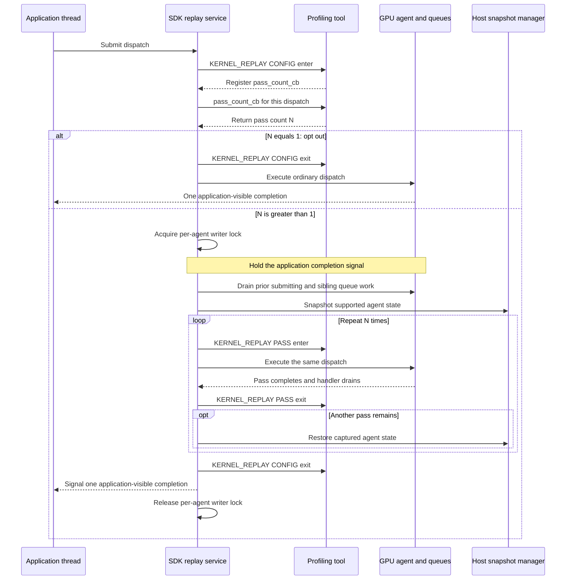
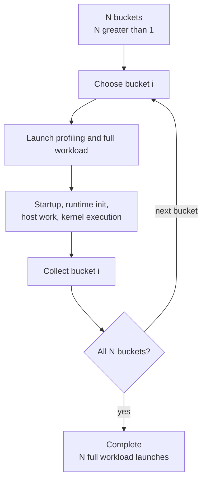
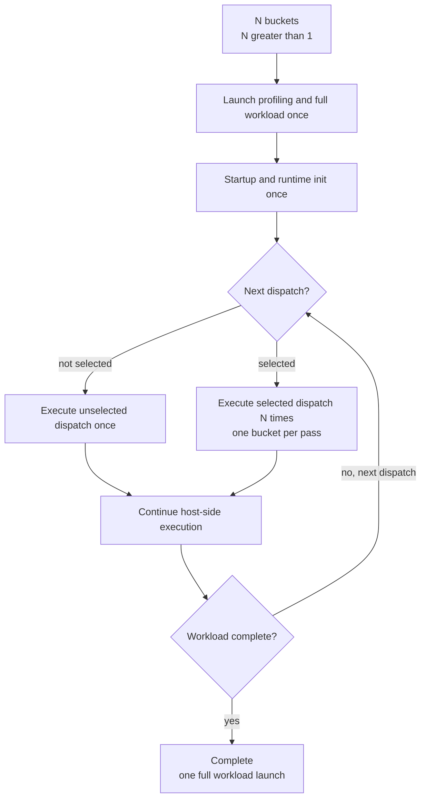
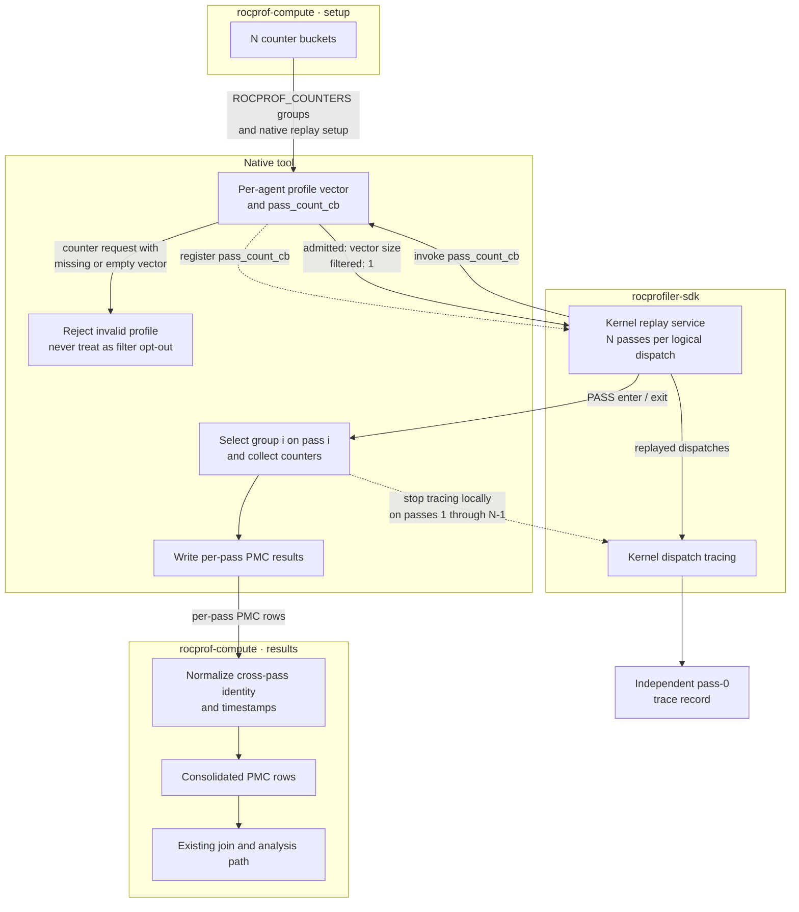
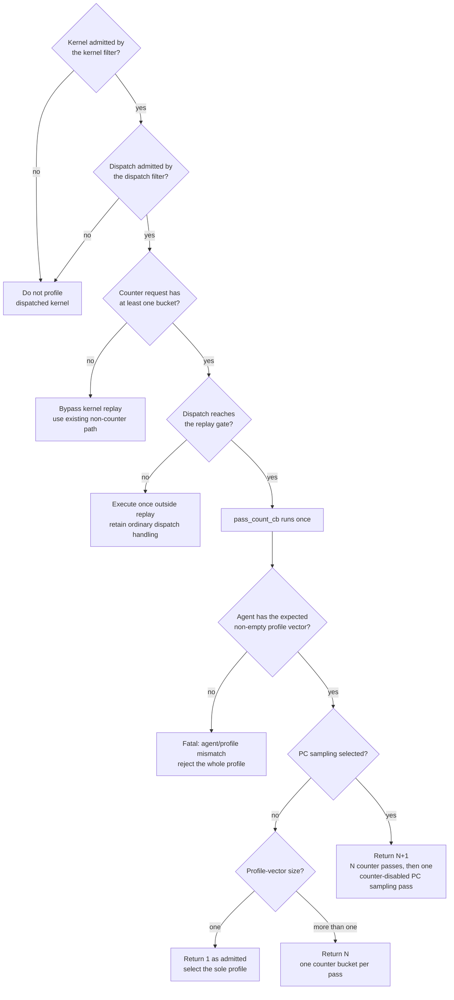

# Kernel replay in rocprof-compute

## System Context

### Terms

| Term | Meaning |
| --- | --- |
| **Bucket** | A group of hardware counters small enough to fit one hardware pass. |
| **Logical dispatch** | One kernel launch as the application issued it, however many times a replay strategy executes it. |
| **Native tool** | A `rocprof-compute` library. |

### Counter collection today

| Strategy | Execution model | Pros | Cons |
| --- | --- | --- | --- |
| **Application replay** | Launch and run the complete workload once per bucket. | Every bucket, across corresponding replayed dispatch occurrences — nothing is estimated from other occurrences. | Repeats process startup, runtime initialization and host work. |
| **Iteration multiplexing** | Launch once and let the native tool rotate buckets across comparable dispatches. Analysis imputes each dispatch's missing counters. | Avoids repeated launches for workloads with enough dispatches. | Never collects every bucket from one logical dispatch. Undersampled kernels cannot produce a complete metric set. |

- Every configuration consumes the same buckets. Application replay works across all of them;
  iteration multiplexing hard-errors without the native tool.
- Application replay is therefore the only strategy today that satisfies a multi-bucket request
  without borrowing counters from neighbouring dispatches.

### Co-active profiling services

Counter collection never runs alone. Every counter collection invocation must produce kernel-dispatch records,
because those records carry the kernel records.

| Service | Context owner | Per dispatch? | Consequence under replay |
| --- | --- | --- | --- |
| Kernel dispatch tracing | Separate tracing context | Yes | *N* records for one logical dispatch. |
| Marker / ROCTx tracing | Separate tracing context | Host-side, spans all passes | Region duration absorbs replay overhead. |
| Code-object tracing | Native tool | No | Unaffected |
| PC sampling | Own invocation today | Agent-wide | Becomes its own replay pass. |
| Counter collection | Native tool | Yes | The point of the feature: one bucket per pass. |

### Proposed SDK replay mechanism

[ROCm PR 8622](https://github.com/ROCm/rocm-systems/pull/8622) proposes the SDK mechanism that this design
relies on.

| Domain / operation | SDK | Profiling tool |
| --- | --- | --- |
| `KERNEL_REPLAY` `CONFIG` enter | Once per dispatch reaching the replay gate | Supply `pass_count_cb` (fixed-pass path). |
| `pass_count_cb` | Once per dispatch, before any pass | Return the pass count. May consult the dispatch's agent information. |
| `KERNEL_REPLAY` `PASS` enter / exit | Delimits each execution inside a replay window | Select the counter profile for this pass. |
| `KERNEL_REPLAY` `CONFIG` exit | After the last pass | — |

| `pass_count_cb` returns | SDK behavior |
| --- | --- |
| `1` | Ordinary single-execution path. No replay window, no snapshot, no `PASS` callbacks. |
| Greater than `1` | Opens a replay window with that many passes. |

SDK also lets a profiling tool locally stop a context for selected replay passes.

- **Snapshot coverage.** Tracked, agent-owned, coarse-grained device allocations that are neither
  kernarg nor executable memory. The SDK separately discovers and captures module-scope `__device__`
  and `__constant__` storage visible to the agent.
- **Isolation.** A replay window isolates a GPU agent.
- **Restoration.** The snapshot is restored between passes, so every pass starts from identical
  device state.

#### Replay coverage and limitations

| State or feature | Replay guarantee |
| --- | --- |
| Allocated device memory (`hipMalloc`) | Snapshotted and restored between passes. |
| Module-scope `__device__` / `__constant__` state | Discovered and captured by the SDK. |
| Unified, managed, `hipMallocAsync` allocations | Not restored. No equivalence guarantee. |
| Cache state | Not restored. Cache-sensitive counter values may vary between passes. |
| HIP graph launches | Unsupported. |
| Multi-packet or multi-dispatch submissions | Not replayed. Only single-packet, single-dispatch submissions are. |
| Asynchronous SDMA or HSA copies | Not fenced by the replay window. |
| Host memory | Required at least as much as the tracked device memory footprint. |
| Multi-rank dispatches | Unsafe. |

## Problem statement

When a counter request produces *N* buckets and *N* is greater than one:

| Per counter-collection run | Application replay | Kernel replay |
| --- | --- | --- |
| Workload launches | *N* | 1 |
| Process startup, runtime initialization | *N*× | 1× |
| Host-side work | *N*× | 1× |
| Executions of a replay-eligible dispatch | *N* (one per launch) | *N* (one per pass) |
| Executions of every other dispatch | *N* | 1 |
| Added cost | — | Snapshot, restore, queue drain, agent isolation |

Only the selected kernel needs profiling *N* times. For workloads with a large startup cost,
application replay requires a lot of time.

- **Iteration multiplexing does not close this gap.** It avoids the repeated launches, but collects
  counters from different dispatches and fills each dispatch's gaps during analysis. It cannot
  collect every counter from repeated executions of *one* logical dispatch in a single workload run.
- **This is not free.** Kernel replay drops the repeated full-workload launches but adds snapshot,
  restoration, dispatch replay, and isolation costs. It will not be faster for every workload.

The flows below compares counter collection when *N* is greater than one. It does not include other
services outside counter collection.

### Application replay

### Kernel replay

## Requirements

### Functional requirements

#### Mode selection

| ID | Requirement |
| --- | --- |
| **FR-1** | `rocprof-compute profile` exposes `--replay-mode {application,kernel}`, defaults to `application`. `--iteration-multiplexing` stay independent. |
| **FR-2** | For *N* buckets, kernel mode uses one workload invocation for counter collection and collects one bucket in each of *N* passes, for every replay-eligible dispatch. No user-supplied pass count. A zero-bucket request bypasses kernel-replay and retains existing path. |
| **FR-3** | Kernel replay requires the native tool. The `rocprofv3` backend and `--no-native-tool` are unsupported. A declined native tool, or a ROCm version that does not support one, is a hard error naming the unmet condition, before any workload runs. |

#### Passes and buckets

| ID | Requirement |
| --- | --- |
| **FR-4** | Bucket membership matches application replay. `_ACCUM` pairing, TCC grouping, and same-bucket priority are unchanged, and every bucket still fits one hardware pass. |
| **FR-5** | Pass count equals the bucket count, or the bucket count plus one when `--pc-sampling` is selected. |
| **FR-6** | The PC sampling pass runs with counter collection disabled, and alters neither bucket membership nor the ordering of the counter passes preceding it. |

#### Output and identity

| ID | Requirement |
| --- | --- |
| **FR-7** | One kernel-replay invocation produces one consolidated counter result using the existing naming and discovery convention, which analysis path consume with no analysis-side contract change. |
| **FR-8** | All passes of one logical dispatch resolve to one `Dispatch_ID` group holding the complete counter set. |
| **FR-9** | Start and end timestamps follow the same cross-pass normalization semantics used for application-replay results. |

#### Composition and filtering

| ID | Requirement |
| --- | --- |
| **FR-11** | Kernel replay with `--iteration-multiplexing` or `--attach-pid` is a hard error. `--roof-only`, `--set`, and `--block` interoperate unchanged. |
| **FR-12** | A dispatch whose kernel is excluded is not replayed. |
| **FR-13** | `--dispatch` retains its per-kernel dispatch filtering. Replay-ineligible kernel dispatch is not replayed. |
| **FR-14** | Kernel replay stays available for multi-rank workloads and emits a kernel-replay-specific diagnostic describing the risk. |

#### Failure

| ID | Requirement |
| --- | --- |
| **FR-15** | An SDK below the supported version floor is a hard error stating the required version. |
| **FR-16** | If the SDK declines a device-memory snapshot, abandon the profile without retry and recommend application replay in the diagnostic. |
| **FR-17** | If the upstream replay mechanism aborts, report the failed run without attempting recovery. |
| **FR-18** | If counters were requested but an agent has no usable counter profiles, do not silently degrade the dispatch to one pass. |

### Non-functional requirements

| ID | Requirement |
| --- | --- |
| **NFR-1** | For deterministic workload and counters, each kernel-replay counter value matches the corresponding application-replay counter value for the same logical dispatch. |
| **NFR-2** | Fail closed whenever a complete counter set cannot be delivered. Never collect partial counter data silently. |
| **NFR-3** | Workflows that do not select kernel replay keep their current collection behavior, and kernel-replay output preserves the existing analysis input contract. |

## Design

### Counter groups and the native-tool boundary

- **The counter-grouping logic stays the same for both modes.**
  `_ACCUM` pairing, TCC grouping, and same-bucket priority policies produce the same *N* buckets for
  both modes.
- **All *N* groups go to a single tool invocation.** The native tool derives the pass
  count from the per-agent counter profiles, adding one when PC sampling is selected.
- **Consolidated results keep the existing naming convention.**
- **Results have unified structure across modes.**
- **No separate pass-count option or environment value.**

### The pass-count decision

Kernel and dispatch filters establish whether the dispatch is profiled before counter-bucket
availability is considered. An admitted zero-bucket request bypasses kernel replay and
follows the existing path. For an admitted kernel, `pass_count_cb` determines the
pass count exactly once before any replay pass.

| Actual kernel dispatch | When | What the execution selects |
| --- | --- | --- |
| `1` — filtered | A confirmed filter miss — the kernel or dispatch is excluded. | Not profiled. |
| `1` — admitted | The dispatch is admitted and its agent's profile vector contains exactly one bucket, no PC sampling. | SDK selects the sole profile and produces a complete one-bucket result. |
| *N*, where *N* > 1 | Admitted, no PC sampling. *N* is the size of the profile vector for this dispatch's agent. | Pass *i* selects entry *i* of that vector. |
| *N*+1 | Admitted, PC sampling selected. *N* is the non-zero size of the profile vector. | Passes 0 through *N*−1 map one-to-one onto the vector. Pass *N* selects no counter profile and runs counter-disabled. |

### Output and dispatch ID

A single dispatch produces one consolidated counter result. Before it is
written, every pass for a logical dispatch must be collapsed.

| Step | What happens |
| --- | --- |
| 1. Correlate | Group the pass rows by logical-dispatch ID. |
| 2. Normalize timestamps | Give the group one canonical start/end pair using pass 0's logical duration. |
| 3. Hand off | The existing identity and pivot contracts see a single set per dispatch. |

Pass identity survive transiently for normalization and diagnostics but it does not reach
the counter result output. Non-replay identity behavior is untouched.

### Co-active service composition

| Service or output | Under kernel replay | Mechanism |
| --- | --- | --- |
| Kernel dispatch tracing | One trace record per logical dispatch, from pass 0 | The native tool owns the context, so it locally stops kernel tracing for passes 1 through *N*−1. |
| Top Stats and dispatch information | One logical counter dispatch and its pass-0 duration | These outputs consume the consolidated dispatch data. |
| Code-object tracing | Unchanged | Load-time only. Replay never multiplies it. |
| Marker / ROCTx | Emitted once, spans all passes | Duration semantics are an open question. |
| PC sampling | One extra pass, appended after the counter passes | Runs counter-disabled. |
| Roofline | Unchanged |  |

### Mode and option compatibility

`--replay-mode` accepts `application` and `kernel`. Application replay stays the default, CLI help
flags kernel replay as experimental.

| Option or condition | With kernel replay |
| --- | --- |
| `--iteration-multiplexing` | Rejected | 
| `--attach-pid` | Rejected | Live attach cannot open a replay window over an already-running process. |
| `--no-native-tool`, `rocprofv3` backend | Rejected | 
| `--pc-sampling` | Accepted, *N*+1 passes |
| `--roof-only`, `--set`, `--block` | Accepted, unchanged |
| Multi-rank | Accepted, with a kernel-replay-specific diagnostic |

### Failure behavior

Every failure below rejects partial replay data. None falls back to application replay, and none
quietly turns a multi-bucket request into a single pass.

| Condition | Required behavior |
| --- | --- |
| Native tool not selected while kernel replay is selected | Hard error from the argument combination alone, before discovery. |
| Native tool unavailable: unsupported ROCm version or unresolvable library | Hard error after discovery, naming which of the two failed. |
| SDK below the supported version floor | Hard error stating the required version. |
| Iteration multiplexing or live attach selected with kernel replay | Hard error before profiling starts. |
| Missing or unexpectedly empty per-agent profile vector when counters were requested | Hard error describing the profile mismatch. |
| SDK declines the device-memory snapshot | Abandon the entire profile without retry, reject incomplete output, and recommend application replay. |
| Upstream drain timeout or process abort | Abort the failed run. |

One wrinkle: a declined snapshot currently leave a successful process status behind, so the
required outcome cannot lean on subprocess failure alone. Classifying an upstream warning string is
the signal available today. A structured detection mechanism remains an open question.

## Implementation phases

| Phase | Delivers | Observable after this phase |
| --- | --- | --- |
| **1. Mode selection and validation** | The experimental `--replay-mode {application,kernel}` surface and rejections with their error diagnostics. Replay execution stays disabled. | Mode selection and correct rejection. Existing application-replay output does not change. |
| **2. Native-tool kernel replay** | Coalesced counter groups delivered to the SDK invocation; the multi-group admission check extended to admit kernel replay; `pass_count_cb` implemented from the per-agent profile-vector size; both filters applied; and diagnosed failure on a missing or unexpectedly empty counter profiles. | Replayed dispatches collect every bucket in one run, including valid one-bucket requests, while zero-bucket requests retain the existing bypass. Application replay keeps working throughout. |
| **3. Consolidated output and dispatch ID** | One consolidated counter result using the existing naming convention, cross-pass timestamp and dispatch ID normalization. | Analysis consumes kernel-replay profiling output; Top Stats and dispatch information report non-multiplied values. |

## Validation, security and debuggability

### Validation

| # | Check | Pass criterion |
| --- | --- | --- |
| 1 | **Counter accuracy** | For a deterministic workload requesting more than one bucket; for each logical dispatch, every kernel-replay counter value matches its corresponding application-replay counter value. Evaluate cache-sensitive counters separately, as a documented limitation. |
| 2 | **Completeness and identity** | For each admitted dispatch, including an admitted one-bucket dispatch, the observed counter-pass count equals the application-replay count, every counter appears exactly once, and all passes collapse to one `Dispatch_ID`. Incomplete results fail before analysis. |
| 3 | **Filtering** | Kernel and dispatch excluded kernels are not profiled and no errors are thrown. The same `--dispatch` range selects the same dispatches in both replay modes. | 
| 4 | **Application-replay comparison** | Profile the same deterministic workload and multi-bucket counter request in both modes. Compare corresponding buckets for each logical dispatch; bucket membership, counter values, and final analysis results agree, and existing application replay is unchanged. |
| 5 | **Kernel tracing** | Verify independently that kernel tracing emits one pass-0 record per logical dispatch and that is used for kernel duration in analysis. | 
| 6 | **PC sampling** | Each admitted dispatch replays *N*+1 times. Every bucket appears exactly once across passes 0 through *N*−1, and pass *N* produces PC sampling output and no counter rows. |
| 7 | **Compatibility** | Every accepted option behaves as expected — PC sampling, roofline selection, a kernel-replay-specific multi-rank diagnostic that names the collective kernel risk, and default-off — and every rejected combination is rejected: iteration multiplexing, live attach. |
| 8 | **Configuration rejection** | Each unmet condition on its own — no native tool, unsupported ROCm version, unresolvable library — fails before profiling starts, with a diagnostic naming that specific condition. | 
| 9 | **Failure paths** | An unsupported SDK, a missing or unexpectedly empty profile vector when counters were requested, a declined snapshot, and an upstream abort each fail, and each proves no one-pass fallback happened. A zero-bucket request follows the existing bypass and is not misclassified as a missing-profile failure. |
| 10 | **Diagnostics** | Every run identifies the replay mode and names its specific condition. |

### Security

- Kernel replay adds no network interface and no new privilege boundary.
- Its one security-sensitive operation is the SDK-managed host snapshot of application device memory.
  That snapshot hold application data and should stay inside the profiled process's trust boundary, and `rocprof-compute` must never
  persist its contents in result artifacts or print them in diagnostics.
- Snapshot allocation and restore failures are availability failures, and follow the same fail-closed
  rule as every other incomplete replay condition.

### Debuggability

A diagnostic must name the specific unmet condition.

| A diagnostic must identify |
| --- | --- |
| Selected replay mode and backend | 
| Multi-rank detection under kernel replay |
| SDK capability and agent | 
| Counter-to-pass mapping |
| Which failure occurred: option conflict, unavailable native collection, missing profile, snapshot decline, or upstream abort |
| That partial results are unusable |
| A recommendation of application replay, on snapshot decline |

## Open questions

| # | Question | Why it matters |
| --- | --- | --- |
| 1 | Should kernel replay exclude collective kernels? | This will make multi-rank profiling with kernel possible but the metrics won't reflect the statistics for all kernel invocations. |
| 2 | Marker durations: reject the combination, or correct the duration? | The host emits these regions once, but they span every pass, so their durations subsumes multiple kernel replay durations. |
| 3 | Are cache-related metrics trustworthy at all under kernel replay? | Nothing restores cache state between passes, so cache-related counters do not represent the true cache behavior. | 
| 4 | How should `rocprof-compute` detect a declined snapshot? | Today the only signal is classifying an upstream warning string, and the process status can still report success. |
