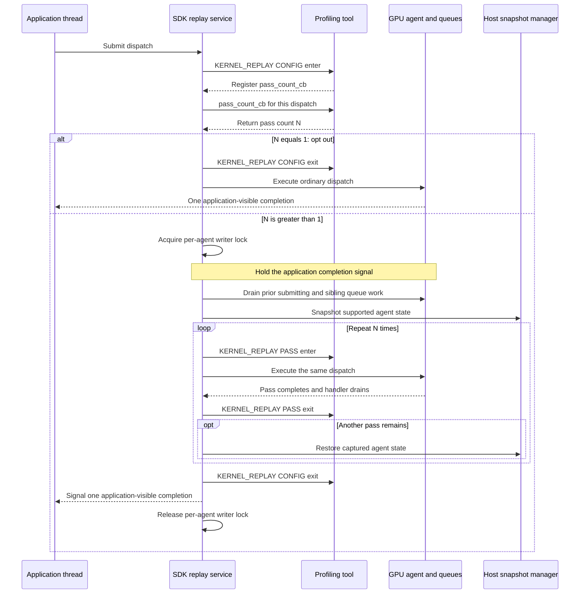
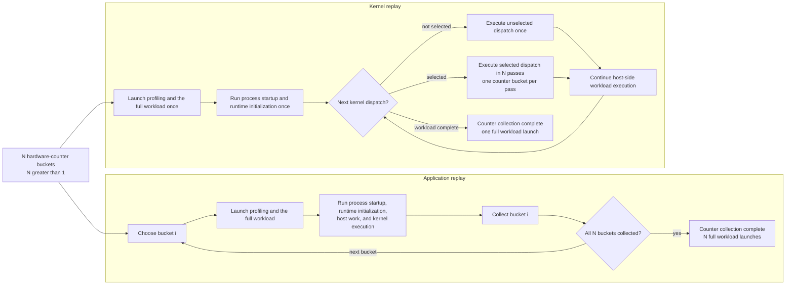
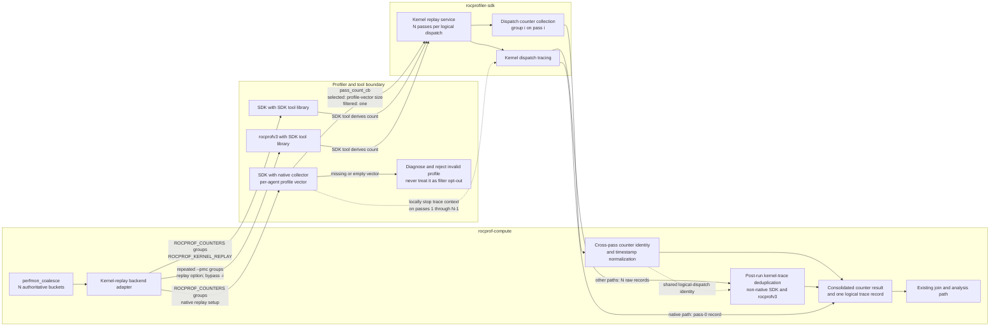

# Kernel replay in rocprof-compute

## System Context

### Counter collection today

`rocprof-compute` maps the requested analysis metrics to hardware counters and
packs those counters into groups that each fit one hardware pass. The number of
groups therefore determines how many counter-collection passes are needed.

The profiling layer can invoke `rocprofv3`,`rocprofiler-sdk`, or
`rocprof-compute` native collector. All three configurations consume the same buckets. Application
replay work across them; iteration multiplexing is limited to native collector.

| Strategy | Execution model | What it covers | What it does not cover |
| --- | --- | --- | --- |
| **Application replay** | Launch and run the complete workload once per bucket, then combine the collected counters. | Collects every bucket across corresponding replayed dispatch occurrences without estimating missing counters from other occurrences. | Repeats process startup, runtime initialization, host work, and the workload itself. Multi-bucket live attach is rejected, and communicating multi-rank workloads currently trigger a warning. |
| **Iteration multiplexing** | Launch the workload once for counter collection and use the native collector to rotate buckets across different comparable dispatch occurrences. Analysis imputes the counters missing from each occurrence. | Avoids repeated application launches for workloads with enough dispatches. | Does not collect every bucket from one logical dispatch. Undersampled kernels cannot produce a complete metric set. It also requires the native collector. |

Application replay is therefore the only current strategy that covers a multi-bucket request
without cross-dispatch imputation.

### Co-active profiling services

Counter collection never runs alone. Every counter invocation must yield kernel-dispatch records;
those records supply the kernel counts and durations. The SDK backend explicitly enables kernel dispatch tracing and adds
marker or ROCTx tracing for a framework-selected run.

The native collector also subscribes to code-object tracing, but those events describe load-time
objects rather than individual dispatches and are not multiplied by kernel replay. PC sampling runs
in a separate invocation.

### Proposed SDK replay mechanism

[ROCm PR 8622](https://github.com/ROCm/rocm-systems/pull/8622) proposes the SDK mechanism that this
design must consume. The mechanism is a surrounding component and an external constraint; this HLD
does not propose changes to its replay algorithm.

The PR adds a `KERNEL_REPLAY` callback domain with `CONFIG` and `PASS` operations. In the fixed-pass
path that `rocprof-compute` would use, a profiling tool supplies `pass_count_cb` during `CONFIG`.
The callback is evaluated for each dispatch that reaches the replay gate and can use its agent
information. Returning `1` opts out: the SDK follows its ordinary single-execution path without
taking a snapshot or issuing `PASS` callbacks. Returning a count greater than one opens a replay
window, and `PASS` enter and exit callbacks delimit each execution in that window.

The same upstream mechanism lets a tool locally stop a context for selected replay passes. Kernel
dispatch tracing honors that local stop and omits the disabled context's dispatch record. This is an
external capability used by the service-composition design below.

The replay window isolates one GPU agent. The SDK takes a host-side writer lock keyed by that
agent, holds the application's completion signal, drains prior work on the submitting and sibling
queues, and copies the supported device state to a host snapshot. It then executes the dispatch
once per pass, restoring the snapshot between passes so each begins from the same device state. The
SDK exits `CONFIG`, signals one application-visible completion, and releases the writer lock.

The snapshot covers tracked, agent-owned, coarse-grained device allocations that are neither
kernarg nor executable memory. Module-scope `__device__` and `__constant__` storage visible to the
agent is discovered and captured separately. While replay is active, ordinary dispatches use the
reader side of the same per-agent lock, while replay windows on different agents can proceed
concurrently.

## Problem statement

When a counter request produces *N* hardware-pass buckets, where *N* is greater than one,
application replay launches and runs the complete workload once per bucket. Counter collection
therefore repeats process startup, runtime initialization, host-side work, and the kernel run
*N* times even though only the kernel needs to be profiled *N* times. This repeated full-workload work
is undesirable for workloads with large startup cost.

Iteration multiplexing avoids those launches, but it obtains the counters from different dispatches
and fills each dispatch's missing counters during analysis. It does not cover the need
to collect every counter through repeated executions of one logical dispatch within a single
workload run.

Kernel replay is intended to fill that gap. It retains the same *N* buckets, runs
the workload once, and executes each replay-eligible dispatch in *N* passes, with one bucket collected
per pass.

Replay also multiplies co-active per-dispatch services. Without explicit handling, kernel dispatch
tracing emits *N* records for one logical dispatch. Top Stats would then report an inflated dispatch
count and aggregate GPU duration.

Kernel replay removes repeated full-workload launches but adds snapshot,
restoration, dispatch replay, and isolation costs. Therefore it may not be faster for every workload.

The following flow compares counter collection for *N* greater than one. It does not include
separate profiler invocations outside counter collection.

## Requirements

### Functional requirements

- `rocprof-compute profile` shall expose `--replay-mode {application,kernel}`, default to
  `application`, and require explicit selection of kernel replay. `--iteration-multiplexing` and its
  policy argument shall remain independent.
- For *N* counter buckets, kernel-replay mode shall use one workload invocation for counter
  collection and collect one bucket in each of *N* passes for every replay-eligible dispatch. No
  user-supplied pass count shall be required.
- Kernel replay shall support `rocprofv3`, native collector, and `rocprofiler-sdk`.
- Kernel replay shall preserve the counter bucket membership used by application replay. The pass count
  shall equal the bucket count, every bucket shall fit one hardware pass, and `_ACCUM` pairing, TCC
  grouping, and same-bucket priority shall remain unchanged.
- One kernel-replay invocation shall produce a consolidated `results_*.csv` artifact that the
  existing workload join and analysis path can consume without an analysis-side contract change.
- All passes of one logical dispatch shall resolve to one `Dispatch_ID` group containing the
  complete counter set. Start and end timestamps shall follow the same cross-pass normalization
  semantics used for application-replay results.
- Kernel replay combined with `--iteration-multiplexing`, `--attach-pid`, or `--pc-sampling` shall
  produce a hard error. `--roof-only`, `--set`, and `--block` shall continue to interoperate
  unchanged.
- Kernel replay shall produce a hard error when the installed SDK predates the supported version
  floor and shall state the required version.
- Kernel replay shall remain available for multi-rank workloads.
- If the SDK declines a device-memory snapshot, `rocprof-compute` shall abandon the profile without
  retry and recommend application replay in the diagnostic.
- If the upstream replay mechanism aborts, `rocprof-compute` shall report the failed run
  without attempting recovery.
- If an agent has no usable counter profiles, `rocprof-compute` shall diagnose the condition rather
  than silently degrading that dispatch to one pass.
- Kernel replay shall expose one kernel-dispatch trace record per logical dispatch, so Top Stats and
  `pmc_dispatch_info.csv` preserve non-replay semantics by reporting one dispatch and its pass-0
  logical duration rather than replay-multiplied values.
- Kernel filtering shall compose with kernel replay on the native collector. A dispatch whose kernel
  is excluded shall not be replayed and shall incur no snapshot or restore.
- Dispatch filtering shall compose with kernel replay on the native collector. `--dispatch` indices
  shall count logical dispatches, not replay passes, so an index selects the same work whether or not
  kernel replay is selected. An excluded dispatch shall not be replayed.

### Non-functional requirements

- For state covered by the replay-equivalence guarantee, a counter present in more than one bucket
  shall have the same value across passes of the same dispatch. Cache-sensitive counters are outside
  this invariant because cache state is not restored.
- Kernel replay shall fail closed whenever it cannot provide a complete bucket set. Silently partial
  counter data shall not be collected.
- Kernel replay shall guarantee equivalent replay state only for tracked coarse-grained VRAM and
  module-scope device or constant state. It shall make no equivalence guarantee for unified,
  managed, or `hipMallocAsync` memory, HIP graphs, multi-packet or multi-dispatch submissions,
  unfenced asynchronous SDMA copies, or cache state, and may require host memory equal to the tracked
  device footprint.
- Workflows that do not select kernel replay shall retain their current collection behavior, and
  kernel-replay output shall preserve the existing analysis input contract.
- Diagnostics shall identify the selected replay mode, the bucket-to-pass mapping, and the specific
  failure condition.

## Design

### Counter groups and backend boundaries

Kernel replay changes the invocation shape, not counter partitioning. `perfmon_coalesce` remains
the only authority for bucket membership and one-pass fit. Its `_ACCUM` pairing, TCC grouping,
and same-bucket priority policies produce *N* buckets for both application and kernel replay. The
kernel-replay adapter translates those buckets into each backend's syntax without regrouping them.

| Backend configuration | Single-invocation encoding | Pass-count owner |
| --- | --- | --- |
| `rocprofiler-sdk` with the native collector | Deliver all *N* groups through `ROCPROF_COUNTERS` to one replay-enabled invocation. | The native collector derives the count from the per-agent profiles it created. |
| `rocprofiler-sdk` without the native collector | Deliver all *N* `ROCPROF_COUNTERS` groups and enable `ROCPROF_KERNEL_REPLAY`. | The SDK tool library derives the count from its per-agent profiles. |
| `rocprofv3` | Bypass `-i`, emit one repeated `--pmc` group per bucket, and enable the upstream replay option. | The SDK tool library derives the count from its per-agent profiles. |

No separate pass-count option or environment value is introduced. That would create a second value
that could disagree with the profiles actually accepted by the SDK. The final spelling of the
multi-group SDK-tool contract must be checked against the merged upstream interface: the current
proposal distinguishes more than one environment-variable spelling. That integration detail may
change, but the `ROCPROF_COUNTERS` semantic contract selected here and the authoritative bucket
membership may not.

### Pass-count ownership and profile validity

On the native path, counter-group parsing creates one profile-vector entry per group and per agent.
For an admitted dispatch, `pass_count_cb` returns the size of the vector for the dispatch's
agent, and replay pass *i* selects entry *i* from that same vector. The count is agent-local and
proves that the requested groups became usable profiles.

The callback's ordinary value of one means “do not replay.” It is not a valid fallback when an agent
lookup fails or its vector is empty: that would execute the dispatch once, collect only one bucket,
and make incomplete data look successful. A missing or empty vector must instead diagnose the
agent/profile mismatch and fail the complete profile. The callback has no error return, so a later
low-level design may choose the exact fatal-tool or run-failure transport; it may not substitute a
count of one.

The non-native SDK and `rocprofv3` paths follow the same ownership rule inside the SDK tool
library. `rocprof-compute` supplies groups and replay enablement; the tool that materializes the
per-agent profiles supplies the callback and count.

The component diagram shows both counter and kernel-trace data. The trace mechanisms differ because
only the native collector is `rocprof-compute`-owned code.

### Native filtering at the pass-count decision

On the native-collector path, `pass_count_cb` is also the filter decision point because it runs
once per logical dispatch before any replay pass. Before choosing a count, the collector confirms
that the dispatch's agent has a non-empty profile vector. It then assigns the dispatch's per-kernel
logical index exactly once, evaluates the kernel-ID target set built during code-object loading and
the requested dispatch range, and returns the profile-vector size only when both filters admit the
dispatch. A confirmed filter miss returns one, intentionally selecting the SDK's ordinary path
without a snapshot or restore. A missing or empty profile vector remains a fatal profile error and
must never use that return.

The per-pass counter-dispatch callback reads the assigned logical index instead of incrementing it.
A non-replay run has one pass per dispatch, so relocating the increment preserves its existing
indices while preventing replay passes from consuming additional indices. Completeness checks apply
only to admitted dispatches; an intentionally excluded dispatch produces no counter set and is not
an incomplete replay result.

### Output and dispatch identity

One kernel-replay counter invocation produces one consolidated
`results_*.csv` artifact, compressed when the existing output policy requires it. The existing
`join_workload_csvs` discovery and concatenation then produce `pmc_perf.csv`, and
`create_df_pmc` performs the existing long-to-wide counter pivot. Kernel replay does not write
`pmc_perf.csv` directly and does not add a replay-specific analysis branch.

Before that artifact is written, all pass rows for one logical dispatch must receive one
`Dispatch_ID` and one canonical start/end timestamp pair. Pass identity may be retained
transiently for normalization and diagnostics, but it need not enter `pmc_perf.csv`.
Non-replay identity behavior remains unchanged.

Application replay aligns corresponding dispatches because each workload invocation starts a fresh
positional ID assignment, even though their timestamps differ. It does not literally rewrite
timestamps. Kernel replay needs the analogous alignment inside one invocation: first correlate the
pass rows using replay-stable logical-dispatch identity, then normalize their timestamp pair before
the existing identity and pivot contracts consume them.

Without that step, the current timestamp-bearing identity key assigns a new `Dispatch_ID` to
every pass. Analysis groups on `Dispatch_ID` before it pivots counter names into columns, so
each group would contain only one bucket and no row would have the complete metric inputs. This is
why normalization belongs at the output boundary rather than in metric evaluation.

### Co-active service composition

Kernel dispatch tracing must yield one record per logical dispatch, independent of the pass count.
The mechanism differs at the ownership boundary:

- The native collector can control its own SDK contexts. It traces pass 0 and locally stops the
  kernel-trace context for passes 1 through *N*−1.
- The non-native SDK and `rocprofv3` paths execute the SDK-owned tool library, which
  `rocprof-compute` cannot instrument. Those paths collapse the *N* raw trace records after the
  run, using the normalized logical-dispatch identity.

This split is forced by code ownership, not by a preference for two deduplication strategies. Both
must produce the same dispatch count for Top Stats and `pmc_dispatch_info.csv`.

Pass 0 is retained because it executes against the pristine pre-snapshot state. Every later pass
follows a full host-to-device restore of the tracked footprint, which perturbs memory-system state.
Pass 0 is therefore the closest available timing proxy for an ordinary dispatch. The design
preserves one non-multiplied logical duration; it does not promise numeric equality with a separate
non-replay measurement.

Roofline uses the selected replay mode through the ordinary counter path and needs no special
handling. Code-object tracing is load-time only and needs no replay treatment. Marker and ROCTx
regions are emitted once on the host but span all passes; their duration semantics remain open.

### Mode and option compatibility

`--replay-mode` accepts `application` and `kernel`. Application replay remains the
default, and CLI help identifies kernel replay as experimental. The selected mode is carried to the
backend adapter; it does not change `--iteration-multiplexing` into a mode selector.

Kernel mode is rejected before profiling when combined with iteration multiplexing, live attach, or
PC sampling. PC sampling is agent-wide, does not consume the localized context override, and today
runs in a separate counter-disabled invocation. There is therefore no supported replay pass into
which it can be inserted.

`--roof-only`, `--set`, and `--block` continue through ordinary counter selection.
Multi-rank profiling remains available and retains its warning. Kernel replay additionally requires
a supported SDK version and a homogeneous agent configuration. Whether collective-bearing
dispatches require exclusion is not settled by that support statement.

### Failure behavior

All failures reject partial replay data. None falls back to application replay or silently changes a
multi-bucket request into one pass.

| Condition | Required behavior |
| --- | --- |
| Unsupported backend configuration | Hard error naming the configuration and a supported alternative. |
| SDK below the supported version floor | Hard error stating the required version. The numeric floor remains pending upstream merge. |
| Iteration multiplexing, live attach, or PC sampling selected with kernel replay | Hard error before profiling starts. |
| Heterogeneous target agents | Hard error because this design assumes one uniform bucket and pass count. |
| Missing or empty per-agent profile vector | Diagnose the agent/profile mismatch and reject the profile; never return one as a fallback. |
| SDK declines the device-memory snapshot | Abandon the entire profile without retry, reject incomplete output, and recommend application replay. |
| Upstream drain timeout or process abort | Report the failed run without recovery or analysis of partial output. |
| Any incomplete bucket set | Reject it before the workload join or metric analysis. |

A declined snapshot can currently leave a successful process status, so the required outcome cannot
depend only on subprocess failure. Classifying an upstream warning string is the available but
fragile signal; a structured detection mechanism remains an open question.

### Support boundaries and rationale

Kernel replay inherits the upstream mechanism's support boundaries:

- The host snapshot can require memory equal to the complete tracked device footprint.
- Equivalent-state guarantees cover tracked coarse-grained device VRAM and module-scope
  `__device__` or `__constant__` state. Unified, managed, and `hipMallocAsync`
  allocations are not restored.
- HIP graph launches are unsupported.
- Only single-packet, single-dispatch submissions are replayed; other submissions execute without
  replay.
- Asynchronous SDMA or HSA copies are not fenced by the replay window.
- Cache state is not restored, so cache-sensitive counter values may vary.
- Bounded drain expiry aborts the process instead of returning a recoverable error.
- Multi-rank dispatches that participate in collectives remain unsafe pending an exclusion policy.

Keeping grouping in `perfmon_coalesce` preserves the architecture policies used by application
replay. Deriving the count where profiles are materialized avoids a second source of truth.
Backend-local encoding contains profiler syntax at the adapter, and preserving the existing output
contract avoids a second analysis implementation. These contracts are settled. The remaining
choices concern the final upstream interface, declined-snapshot signaling, and the explicitly
deferred service policies below.

## Implementation phases

These are proposed vertical slices for future implementation work; they are not scheduled by this
HLD. No source implementation, tests, or user documentation are delivered with the design.
Application replay remains the default throughout, and kernel-replay output must not reach analysis
until the implementation can provide a complete bucket set or fail closed.

1. **Mode selection and validation.** Add the experimental
   `--replay-mode {application,kernel}` surface, carry the selected mode through the profiling
   backends, and implement compatibility checks and hard-error diagnostics. Replay execution
   remains disabled in this slice, so its observable behavior is mode selection and validation
   without changing existing application-replay output.
2. **Native-collector replay.** Deliver the coalesced counter groups to one native SDK invocation,
   implement the native collector's `pass_count_cb` from its per-agent profile-vector size,
   and diagnose a missing or empty vector instead of returning one pass. Preserve application
   replay while this slice is brought up, and keep replay output away from normal analysis
   until the next slice establishes its completeness contract.
3. **Consolidated output and dispatch identity.** Produce one consolidated
   `results_*.csv`, normalize cross-pass timestamps and identity so all passes of one logical
   dispatch resolve to one `Dispatch_ID`, and reject incomplete bucket sets before they reach
   the unchanged workload join and analysis pivot.
4. **Remaining backends.** Add equivalent single-invocation behavior to `rocprofv3`, using
   repeated `--pmc` groups while bypassing `-i`, and to the non-native SDK
   configuration, using the counter groups and kernel-replay enablement expected by the SDK tool
   library. Both paths converge on the same trace, validation, failure, identity, and output
   contracts as the native path.

## Validation, security and debuggability

This section defines the strategy for a future implementation. This HLD does not add or schedule
tests.

### Validation

Validation spans the CLI, each backend adapter, replay-profile construction, output normalization,
and the unchanged analysis boundary for all three supported configurations.

- **Counter accuracy.** For one logical dispatch and state covered by the equivalence guarantee, a
  counter present in more than one bucket must have the same value in every pass. A mismatch is a
  validation failure. Cache-sensitive counters must be evaluated separately as a documented
  limitation rather than used as an equality oracle.
- **Completeness and identity.** For each dispatch admitted by the replay filters, the observed
  pass count must equal the authoritative `perfmon_coalesce` bucket count, every bucket must appear
  exactly once, and all pass rows must collapse to one complete `Dispatch_ID`. Incomplete results
  must fail before analysis.
- **Native filtering.** Logical indices must advance once per dispatch, not once per pass. A
  confirmed filter exclusion must take the ordinary no-snapshot path and must not be classified as
  a missing-profile failure or an incomplete replay result.
- **Application-replay comparison.** The same deterministic workload and counter request must be
  profiled in both modes to compare bucket membership, counter completeness, dispatch
  correspondence, and final analysis results. Existing application-replay and single-bucket
  behavior must remain unchanged.
- **Service composition.** Kernel replay must expose one pass-0 trace record and one non-multiplied
  logical duration per dispatch. Native local-stop output and post-run deduplication output must be
  compared against the same non-replay dispatch inventory.
- **Compatibility.** Accepted options and every rejected combination must be covered, including
  iteration multiplexing, live attach, PC sampling, roofline selection, multi-rank warning
  retention, and the experimental default-off behavior.
- **Failure paths.** Coverage must include an unsupported SDK or backend, heterogeneous agents, a
  missing profile vector, declined snapshot, incomplete bucket set, and upstream abort. Each case
  must prove that no one-pass fallback or partial analysis occurs.

Unit tests should cover option rules, group serialization, profile-derived counts, identity
normalization, and trace deduplication. Backend integration tests should cover pass-to-profile
selection and failure propagation. End-to-end CLI tests should compare the generated artifacts and
analysis for application and kernel replay. No wall-time threshold is a pass criterion.

### Security

Kernel replay introduces no network interface or new privilege boundary. Its security-sensitive
operation is the SDK-managed host snapshot of application device memory. The snapshot can contain
application data and can consume host memory comparable to the tracked footprint. It remains inside
the profiled process's trust boundary; `rocprof-compute` must not persist its contents in
result artifacts or print them in diagnostics. Snapshot allocation and restore failures are
availability failures and follow the same fail-closed rule as other incomplete replay conditions.

### Debuggability

Run diagnostics must identify the selected replay mode and backend, SDK capability, agent, and the
mapping from every `perfmon_coalesce` bucket to its replay pass. They must distinguish option
conflicts, unsupported configurations, heterogeneous agents, missing profiles, snapshot decline,
incomplete buckets, and upstream abort, and state that partial results are unusable. A
snapshot-decline diagnostic also recommends application replay.

## Open questions

3. **Collective-bearing kernels.** Should dispatches participating in inter-process collectives be
   excluded from kernel replay?
5. **Marker and ROCTx semantics.** Host regions are emitted once but span all replay passes, so
   their durations include replay overhead and are not comparable with a non-replay run. Should the
   combination be corrected, annotated, or rejected?
6. **Trace-deduplication equivalence.** How will native pass-0 context control and post-run
   deduplication share one definition of a logical dispatch, and how will divergence between those
   mechanisms be detected?
7. **Filtering on non-native backends.** `rocprofv3` and `rocprofiler-sdk` without the
   native collector resolve filters inside the SDK tool library. Does that library count logical
   dispatches or replay passes under kernel replay? If it counts passes, an upstream correction or
   an explicit documented restriction is required.
