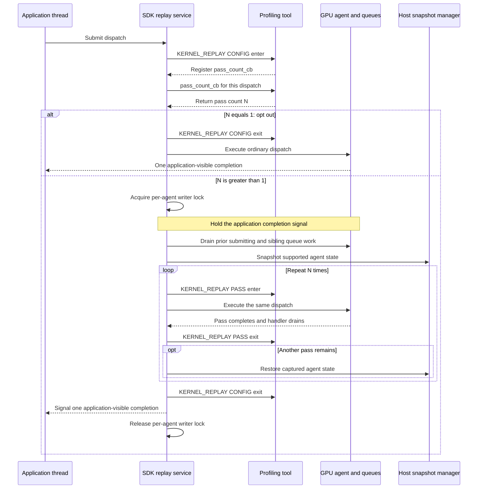
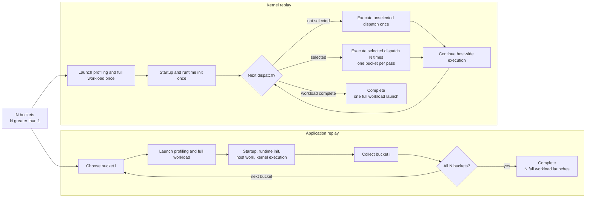
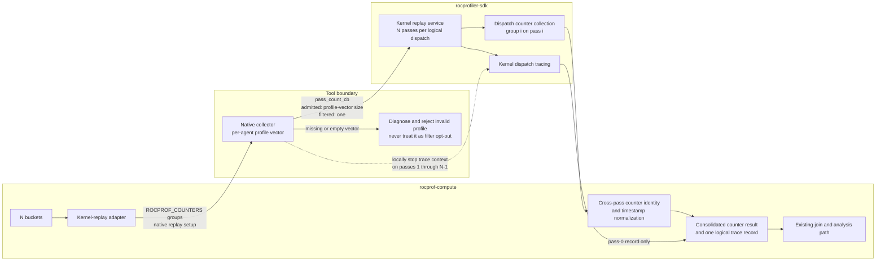
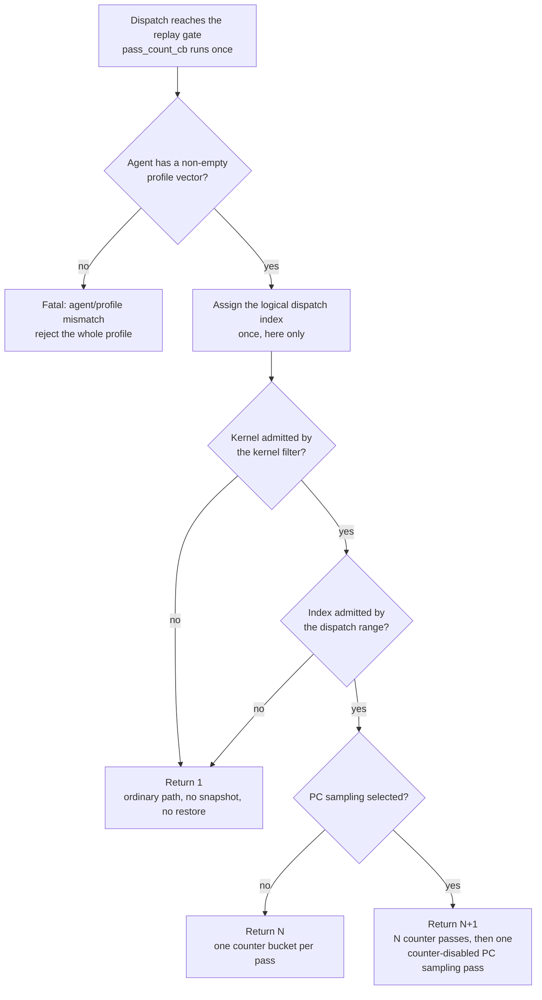

# Kernel replay in rocprof-compute

## System Context

### Terms

| Term | Meaning |
| --- | --- |
| **Bucket** | A group of hardware counters small enough to fit one hardware pass. `rocprof-compute` turns the metrics an analysis asks for into counters, then packs them into buckets. The bucket count is the pass count. |
| **Logical dispatch** | One kernel launch as the application issued it, however many times a replay strategy executes it. |
| **Native collector** | A `rocprof-compute` library it can preload to take over counter collection, while tracing runs in a separate context. Unavailable when the user declines it, or when the installed ROCm predates support for it. |

### Counter collection today

| Strategy | Execution model | Covers | Does not cover |
| --- | --- | --- | --- |
| **Application replay** | Launch and run the complete workload once per bucket, then combine the counters. | Every bucket, across corresponding replayed dispatch occurrences — nothing is estimated from other occurrences. | Repeats process startup, runtime initialization, host work, and the workload itself. Multi-bucket live attach is rejected; communicating multi-rank workloads warn. |
| **Iteration multiplexing** | Launch once and let the native collector rotate buckets across comparable dispatch occurrences. Analysis imputes each occurrence's missing counters. | Avoids repeated launches for workloads with enough dispatches. | Never collects every bucket from one logical dispatch. Undersampled kernels cannot produce a complete metric set. Requires the native collector. |

- Every configuration consumes the same buckets. Application replay works across all of them;
  iteration multiplexing hard-errors without the native collector.
- Application replay is therefore the only strategy today that satisfies a multi-bucket request
  without borrowing counters from neighbouring dispatches.

### Co-active profiling services

Counter collection never runs alone. Every counter invocation must produce kernel-dispatch records,
because those records carry the kernel counts and durations.

| Service | Context owner | Per dispatch? | Consequence under replay |
| --- | --- | --- | --- |
| Kernel dispatch tracing | Separate tracing context | Yes | *N* records for one logical dispatch. Inflates Top Stats and `pmc_dispatch_info.csv`. |
| Marker / ROCTx tracing | Separate tracing context, framework runs only | Host-side, spans all passes | Region duration absorbs replay overhead. |
| Code-object tracing | Native collector | No — load time | Unaffected. Replay does not multiply load-time events. |
| PC sampling | Own invocation today | Agent-wide | Becomes its own replay pass. |
| Counter collection | Native collector | Yes | The point of the feature: one bucket per pass. |

The split matters: the trace records come from a context the native collector can control but does
not itself emit.

### Proposed SDK replay mechanism

[ROCm PR 8622](https://github.com/ROCm/rocm-systems/pull/8622) proposes the SDK mechanism this design
must consume. Treat it as a surrounding component and an external constraint — nothing here proposes
changes to its replay algorithm.

| Domain / operation | Fires | The tool's part |
| --- | --- | --- |
| `KERNEL_REPLAY` `CONFIG` enter | Once per dispatch reaching the replay gate | Supply `pass_count_cb` (fixed-pass path). |
| `pass_count_cb` | Once per dispatch, before any pass | Return the pass count. May consult the dispatch's agent information. |
| `KERNEL_REPLAY` `PASS` enter / exit | Delimits each execution inside a replay window | Select the counter profile for this pass. |
| `KERNEL_REPLAY` `CONFIG` exit | After the last pass | — |

| `pass_count_cb` returns | SDK behavior |
| --- | --- |
| `1` | Ordinary single-execution path. No replay window, no snapshot, no `PASS` callbacks. |
| Greater than `1` | Opens a replay window with that many passes. |

The same upstream mechanism lets a tool locally stop a context for selected replay passes. Kernel
dispatch tracing honors that local stop and omits the disabled context's dispatch record — an
external capability the service-composition design below leans on.

- **Snapshot coverage.** Tracked, agent-owned, coarse-grained device allocations that are neither
  kernarg nor executable memory. The SDK separately discovers and captures module-scope `__device__`
  and `__constant__` storage visible to the agent.
- **Isolation.** A replay window isolates one GPU agent. Ordinary dispatches take the reader side of
  the same per-agent lock; replay windows on different agents still run concurrently.
- **Restoration.** The snapshot is restored between passes, so every pass starts from identical
  device state.

## Problem statement

When a counter request produces *N* buckets and *N* is greater than one:

| Per counter-collection run | Application replay | Kernel replay |
| --- | --- | --- |
| Workload launches | *N* | 1 |
| Process startup, runtime initialization | *N*× | 1× |
| Host-side work | *N*× | 1× |
| Executions of a replay-eligible dispatch | *N* (one per launch) | *N* (one per pass) |
| Executions of every other dispatch | *N* | 1 |
| Added cost | — | Snapshot, restore, queue drain, agent isolation |

Only the kernel actually needs profiling *N* times. For workloads with a large startup cost,
application replay wastes a lot of wall-clock repeating everything else.

- **Iteration multiplexing does not close this gap.** It avoids the repeated launches, but pulls
  counters from different dispatches and fills each dispatch's gaps during analysis. It cannot
  collect every counter from repeated executions of *one* logical dispatch in a single workload run.
- **Replay multiplies the co-active services.** Left alone, kernel dispatch tracing emits *N* records
  for one logical dispatch, and Top Stats reports an inflated dispatch count and aggregate GPU
  duration.
- **This is not free.** Kernel replay drops the repeated full-workload launches but adds snapshot,
  restoration, dispatch replay, and isolation costs. It will not be faster for every workload.

The flow below compares counter collection when *N* is greater than one. It leaves out profiler
invocations outside counter collection.

## Requirements

### Functional requirements

#### Mode selection

| ID | Requirement | Why |
| --- | --- | --- |
| **FR-1** | `rocprof-compute profile` exposes `--replay-mode {application,kernel}`, defaults to `application`, and requires explicit selection of kernel replay. `--iteration-multiplexing` and its policy argument stay independent. | Kernel replay carries support boundaries application replay does not. Opt-in, not inferred. |
| **FR-2** | For *N* buckets, kernel mode uses one workload invocation for counter collection and collects one bucket in each of *N* passes, for every replay-eligible dispatch. No user-supplied pass count. | Removing the repeated launches is the whole point. A user-set pass count could disagree with the bucket count. |
| **FR-3** | Kernel replay requires the native collector. The `rocprofv3` backend and `--no-native-tool` are unsupported. A declined native collector, or a ROCm version that does not support one, is a hard error naming the unmet condition, before any workload runs. | Only the native collector owns the SDK contexts replay needs. Failing late wastes a workload run. |

#### Passes and buckets

| ID | Requirement | Why |
| --- | --- | --- |
| **FR-4** | Bucket membership matches application replay. `_ACCUM` pairing, TCC grouping, and same-bucket priority are unchanged, and every bucket still fits one hardware pass. | Kernel replay changes the shape of the invocation, not how counters partition. Divergence would make the two modes incomparable. |
| **FR-5** | Pass count equals the bucket count, or the bucket count plus one when `--pc-sampling` is selected. | Derived, never configured, so the two cannot drift apart. |
| **FR-6** | The PC sampling pass runs with counter collection disabled, and alters neither bucket membership nor the ordering of the counter passes preceding it. | PC sampling is agent-wide and must not perturb counter results. |

#### Output and identity

| ID | Requirement | Why |
| --- | --- | --- |
| **FR-7** | One kernel-replay invocation produces one consolidated `results_*.csv` that the existing workload join and analysis path consumes with no analysis-side contract change. | Analysis should not need to know which replay mode produced its input. |
| **FR-8** | All passes of one logical dispatch resolve to one `Dispatch_ID` group holding the complete counter set. | Analysis groups on `Dispatch_ID` before pivoting counters into columns. Per-pass IDs would leave every group holding one bucket. |
| **FR-9** | Start and end timestamps follow the same cross-pass normalization semantics used for application-replay results. | Same reason as FR-8, and it keeps durations comparable between modes. |
| **FR-10** | Exactly one kernel-dispatch trace record per logical dispatch, so Top Stats and `pmc_dispatch_info.csv` keep non-replay semantics: one dispatch and its pass-0 logical duration, not replay-multiplied values. | Top Stats is the first table users read. *N*× dispatch counts and GPU time would be wrong there. |

#### Composition and filtering

| ID | Requirement | Why |
| --- | --- | --- |
| **FR-11** | Kernel replay with `--iteration-multiplexing` or `--attach-pid` is a hard error. `--roof-only`, `--set`, and `--block` interoperate unchanged. | Both replay strategies claim the same per-dispatch passes. The rest only select counters. |
| **FR-12** | Kernel filtering composes. A dispatch whose kernel is excluded is not replayed and incurs no snapshot or restore. | A filtered dispatch paying full replay cost, only to have its counters discarded, is pure waste. |
| **FR-13** | Dispatch filtering composes. `--dispatch` indices count logical dispatches, not replay passes, so an index selects the same work in either mode. An excluded dispatch is not replayed. | Otherwise `--dispatch 3` with 4 buckets selects the third *pass of the first* dispatch, labelled as the one the user asked for. |
| **FR-14** | Kernel replay stays available for multi-rank workloads. | Multi-rank workloads are exactly the ones with expensive startup. |

#### Failure

| ID | Requirement | Why |
| --- | --- | --- |
| **FR-15** | An SDK below the supported version floor is a hard error stating the required version. | Distinct from the ROCm version the native collector needs. The user must know which one is unmet. |
| **FR-16** | If the SDK declines a device-memory snapshot, abandon the profile without retry and recommend application replay in the diagnostic. | Without a snapshot there is no equivalent state, so no pass after the first is trustworthy. Application replay is the working alternative. |
| **FR-17** | If the upstream replay mechanism aborts, report the failed run without attempting recovery. | Upstream drain expiry aborts the process; there is no recoverable error to catch. |
| **FR-18** | If an agent has no usable counter profiles, diagnose the condition rather than silently degrading that dispatch to one pass. | A single-pass "success" would present one bucket as a complete metric set. |

### Non-functional requirements

| ID | Requirement | Why |
| --- | --- | --- |
| **NFR-1** | For state covered by the replay-equivalence guarantee, a counter present in more than one bucket has the same value across passes of the same dispatch. Cache-sensitive counters fall outside this invariant. | This is the correctness claim kernel replay rests on. Cache state is not restored, so it is excluded explicitly. |
| **NFR-2** | Fail closed whenever a complete bucket set cannot be delivered. Never collect partial counter data silently. | Partial counters produce plausible-looking but wrong metrics. |
| **NFR-3** | Guarantee equivalent replay state only for tracked coarse-grained VRAM and module-scope device or constant state. No guarantee for unified, managed, or `hipMallocAsync` memory, HIP graphs, multi-packet or multi-dispatch submissions, unfenced asynchronous SDMA copies, or cache state. May require host memory equal to the tracked device footprint. | Inherited from the upstream mechanism. Overstating coverage would mislead users into trusting unsupported cases. |
| **NFR-4** | Workflows that do not select kernel replay keep their current collection behavior, and kernel-replay output preserves the existing analysis input contract. | The feature is experimental. It must not regress the default path. |
| **NFR-5** | Diagnostics identify the selected replay mode, the bucket-to-pass mapping, and the specific failure condition. | Every failure here is fatal, so the message is the user's only route to a remedy. |

## Design

### Counter groups and the collector boundary

- **`perfmon_coalesce` stays the single authority** on bucket membership and one-pass fit. Its
  `_ACCUM` pairing, TCC grouping, and same-bucket priority policies produce the same *N* buckets for
  both modes, and the kernel-replay adapter hands those buckets to the native collector without
  regrouping them.
- **All *N* groups go to a single replay-enabled invocation.** The native collector derives the pass
  count from the per-agent profiles it built from them, adding one when PC sampling is selected.
- **No separate pass-count option or environment value exists.** Deriving the count from the buckets
  is what stops the two from drifting apart.

### The pass-count decision

Counter-group parsing creates one profile-vector entry per group, per agent. `pass_count_cb` is the
single decision point for both the pass count and the filters, because it runs exactly once per
logical dispatch and before any replay pass.

| Returns | When | What the passes select |
| --- | --- | --- |
| `1` | A confirmed filter miss — the kernel or the dispatch index is excluded. | Nothing. The SDK takes its ordinary path, deliberately paying no snapshot or restore. |
| *N* | Admitted, no PC sampling. *N* is the size of the profile vector for this dispatch's agent. | Pass *i* selects entry *i* of that vector. |
| *N*+1 | Admitted, PC sampling selected. | Passes 0 through *N*−1 map one-to-one onto the vector. Pass *N* selects no counter profile and runs counter-disabled. |
| *(fatal)* | The agent is missing, or its profile vector is empty. | Nothing. Diagnose the agent/profile mismatch and fail the whole profile. |

Two consequences worth stating plainly:

- **`1` means "do not replay". It is never a fallback.** Returning it on a missing or empty vector
  would execute the dispatch once, collect a single bucket, and present incomplete data as a success.
- **The logical index is assigned here, not incremented per pass.** The per-pass counter-dispatch
  callback reads it. A non-replay run has one pass per dispatch, so moving the increment leaves
  existing indices intact while stopping replay passes from consuming extra ones.

Completeness checks apply only to admitted dispatches. A dispatch excluded on purpose produces no
counter set, and that is not an incomplete replay result.

### Output and dispatch identity

One kernel-replay counter invocation produces one consolidated `results_*.csv`. Before it is
written, every pass row for a logical dispatch must collapse to one identity.

| Step | What happens | If skipped |
| --- | --- | --- |
| 1. Correlate | Group the pass rows by replay-stable logical-dispatch identity. | Nothing ties the passes of one dispatch together. |
| 2. Normalize timestamps | Give the group one canonical start/end pair. | The timestamp-bearing identity key hands every pass its own `Dispatch_ID`. |
| 3. Hand off | The existing identity and pivot contracts see one row set per dispatch. | Analysis pivots each single-bucket group separately, so no row carries the complete metric inputs. |

- Pass identity may survive transiently for normalization and diagnostics; it does not need to reach
  `pmc_perf.csv`. Non-replay identity behavior is untouched.
- Application replay achieves the same alignment differently: each workload invocation restarts
  positional ID assignment from scratch, even though timestamps differ between runs. It never
  literally rewrites timestamps. Kernel replay needs that alignment *inside* a single invocation.

### Co-active service composition

| Service | Under kernel replay | Mechanism |
| --- | --- | --- |
| Kernel dispatch tracing | One record per logical dispatch, from pass 0 | The native collector owns the context, so it locally stops kernel tracing for passes 1 through *N*−1. |
| Code-object tracing | Unchanged | Load-time only. Replay never multiplies it. |
| Marker / ROCTx | Emitted once, spans all passes | Duration semantics are an open question. |
| PC sampling | One extra pass, appended after the counter passes | Runs counter-disabled. |
| Roofline | Unchanged | Picks up the selected mode through the ordinary counter path. |

- **Why pass 0.** It is the only pass running against pristine pre-snapshot state. Every later pass
  starts immediately after a full restore of the tracked footprint, so its timing says more about
  replay overhead than about the dispatch.
- **Why suppress at the source.** Nothing has to reconstruct which records belonged to the same
  logical dispatch, because the extra records never exist. That makes it both cheap and exact.

### Mode and option compatibility

`--replay-mode` accepts `application` and `kernel`. Application replay stays the default, CLI help
flags kernel replay as experimental, and the selected mode travels down to the kernel-replay adapter.
This does not turn `--iteration-multiplexing` into a mode selector.

| Option or condition | With kernel replay | Reason |
| --- | --- | --- |
| `--iteration-multiplexing` | Rejected | Both strategies claim the same per-dispatch passes. Not a backend restriction — iteration multiplexing needs the native collector too. |
| `--attach-pid` | Rejected | Live attach cannot open a replay window over an already-running process. |
| `--no-native-tool`, `rocprofv3` backend | Rejected | Kernel replay needs the SDK contexts only the native collector owns. |
| `--pc-sampling` | Accepted, *N*+1 passes | Agent-wide, and it does not consume the localized context override. It takes a counter-disabled pass of its own. |
| `--roof-only`, `--set`, `--block` | Accepted, unchanged | Ordinary counter selection. |
| Multi-rank | Accepted, keeps its warning | See the open question on collective-bearing dispatches. |
| Heterogeneous agents | Rejected | Kernel replay needs a homogeneous agent configuration. |

Kernel mode needs the native collector, but the conditions that supply one do not all become
knowable at the same moment, so rejection happens in two layers:

| Layer | Decidable from | Rejected when | Workload directory left behind? |
| --- | --- | --- | --- |
| **Flag conflict** | The arguments alone | Kernel replay selected while the native collector is declined | No — rejected before discovery and before the directory is created |
| **Capability failure** | Discovery, once it has resolved the ROCm version and native library | Unsupported ROCm version, or a library that cannot be resolved | Yes — rejected later, but still before the workload runs |

Both are hard errors. Iteration multiplexing and live attach are likewise rejected before profiling
starts.

### Failure behavior

Every failure below rejects partial replay data. None falls back to application replay, and none
quietly turns a multi-bucket request into a single pass.

| Condition | Required behavior | Covers |
| --- | --- | --- |
| Native collector declined while kernel replay is selected | Hard error from the argument combination alone, before discovery. | FR-3 |
| Native collector unavailable: unsupported ROCm version or unresolvable library | Hard error after discovery, naming which of the two failed. | FR-3, NFR-5 |
| SDK below the supported version floor | Hard error stating the required version. Distinct from the ROCm version the native collector needs, so the diagnostic must say which one is unmet. The numeric floor is pending upstream merge. | FR-15 |
| Iteration multiplexing or live attach selected with kernel replay | Hard error before profiling starts. | FR-11 |
| Missing or empty per-agent profile vector | Diagnose the agent/profile mismatch and reject the profile. Never return `1` as a fallback. | FR-18, NFR-2 |
| SDK declines the device-memory snapshot | Abandon the entire profile without retry, reject incomplete output, and recommend application replay. | FR-16, NFR-2 |
| Upstream drain timeout or process abort | Abort the failed run without recovery. | FR-17 |

One wrinkle: a declined snapshot can currently leave a successful process status behind, so the
required outcome cannot lean on subprocess failure alone. Classifying an upstream warning string is
the signal available today, and it is a fragile one. A structured detection mechanism remains an
open question.

### Support boundaries and rationale

Kernel replay inherits the upstream mechanism's support boundaries.

| State or feature | Replay guarantee |
| --- | --- |
| Tracked coarse-grained device VRAM | Snapshotted and restored between passes. |
| Module-scope `__device__` / `__constant__` state | Discovered and captured by the SDK. |
| Unified, managed, `hipMallocAsync` allocations | Not restored. No equivalence guarantee. |
| Cache state | Not restored. Cache-sensitive counter values may vary between passes. |
| HIP graph launches | Unsupported. |
| Multi-packet or multi-dispatch submissions | Not replayed. Only single-packet, single-dispatch submissions are; anything else executes without replay. |
| Asynchronous SDMA or HSA copies | Not fenced by the replay window. |
| Host memory | Requires at least as much as the complete tracked device footprint. |
| Bounded drain expiry | Aborts the process rather than returning a recoverable error. |
| Multi-rank dispatches in collectives | Unsafe until there is an exclusion policy. |

## Implementation phases

| Phase | Delivers | Observable after this phase |
| --- | --- | --- |
| **1. Mode selection and validation** | The experimental `--replay-mode {application,kernel}` surface, the selected mode carried through the profiling path, and both rejection layers with their hard-error diagnostics. Replay execution stays disabled. | Mode selection and correct rejection. Existing application-replay output does not change. |
| **2. Native-collector replay** | Coalesced counter groups delivered to the SDK invocation, `pass_count_cb` implemented from the per-agent profile-vector size, both filters applied at that decision point, and a diagnosed failure on a missing or empty vector. | Replayed dispatches collect every bucket in one run. Application replay keeps working throughout. |
| **3. Consolidated output and dispatch identity** | One consolidated `results_*.csv`, cross-pass timestamp and identity normalization, and the single pass-0 trace record. | Analysis consumes kernel-replay output unchanged, and Top Stats reports non-multiplied values. |

## Validation, security and debuggability

### Validation

Validation spans the CLI, the kernel-replay adapter, replay-profile construction, output
normalization, and the analysis boundary that should not have moved.

| # | Check | Pass criterion | Covers |
| --- | --- | --- | --- |
| 1 | **Counter accuracy** | For one logical dispatch, and for state covered by the equivalence guarantee, a counter present in more than one bucket reports the same value in every pass. Any mismatch is a failure. Evaluate cache-sensitive counters separately, as a documented limitation. | NFR-1, NFR-3 |
| 2 | **Completeness and identity** | For each admitted dispatch, the observed counter-pass count equals the application-replay count, every bucket appears exactly once, and all pass rows collapse into one complete `Dispatch_ID`. Incomplete results fail before analysis. | FR-2, FR-5, FR-7, FR-8 |
| 3 | **Filtering** | Logical indices advance once per dispatch, not once per pass. A confirmed filter exclusion takes the ordinary no-snapshot path, and is read as neither a missing-profile failure nor an incomplete replay result. | FR-12, FR-13 |
| 4 | **Application-replay comparison** | Profile the same deterministic workload and counter request in both modes. Bucket membership, counter completeness, and final analysis results agree, and existing application replay is unchanged. | FR-4, FR-9, NFR-4 |
| 5 | **Service composition** | One pass-0 trace record and one non-multiplied logical duration per dispatch. | FR-10 |
| 6 | **PC sampling composition** | Each admitted dispatch replays *N*+1 times. Every bucket appears exactly once across passes 0 through *N*−1, and pass *N* produces PC sampling output and no counter rows. | FR-6 |
| 7 | **Compatibility** | Every accepted option behaves — PC sampling, roofline selection, the multi-rank warning, default-off — and every rejected combination is rejected: iteration multiplexing, live attach. | FR-1, FR-11, FR-14 |
| 8 | **Configuration rejection** | Each unmet native-collector condition on its own — declined collector, unsupported ROCm version, unresolvable library — fails before profiling starts, with a diagnostic naming that specific condition. | FR-3 |
| 9 | **Failure paths** | An unsupported SDK, a missing profile vector, a declined snapshot, and an upstream abort each fail, and each proves no one-pass fallback happened. | FR-15, FR-16, FR-17, FR-18, NFR-2 |
| 10 | **Diagnostics** | Every run identifies the replay mode and the bucket-to-pass mapping; every failure names its specific condition. | NFR-5 |

### Security

- Kernel replay adds no network interface and no new privilege boundary.
- Its one security-sensitive operation is the SDK-managed host snapshot of application device memory.
  That snapshot can hold application data and can consume host memory comparable to the tracked
  footprint. It stays inside the profiled process's trust boundary, and `rocprof-compute` must never
  persist its contents in result artifacts or print them in diagnostics.
- Snapshot allocation and restore failures are availability failures, and follow the same fail-closed
  rule as every other incomplete replay condition.

### Debuggability

| A diagnostic must identify | Why |
| --- | --- |
| Selected replay mode and backend | The two modes fail differently. The user needs to know which one ran. |
| SDK capability and agent | Version floors and agent homogeneity are both rejection causes. |
| Bucket-to-pass mapping | The only way to confirm the derived pass count matches the request. |
| Which failure occurred: option conflict, unavailable native collection, missing profile, snapshot decline, or upstream abort | Each has a different remedy. |
| That partial results are unusable | Otherwise a user may try to analyze what was written before the failure. |
| A recommendation of application replay, on snapshot decline | It is the working alternative for that specific failure. |

A configuration diagnostic must name the specific unmet condition rather than reporting that the
native collector is unavailable. One message covering both an unsupported ROCm version and an
unresolvable library leaves the user with no action to take, because the remedy differs in each case.

## Open questions

| # | Question | Why it matters | Blocks |
| --- | --- | --- | --- |
| 1 | Should kernel replay exclude dispatches taking part in inter-process collectives? | Replaying one rank's dispatch while its peers do not desynchronizes the collective. | Multi-rank support boundary (FR-14) |
| 2 | Marker and ROCTx durations: reject the combination, or correct the duration? | The host emits these regions once, but they span every pass, so their durations include replay overhead and are not comparable with a non-replay run. | Marker/ROCTx composition |
| 3 | Are cache-related metrics trustworthy at all under replay? | Nothing restores cache state between passes, so cache-sensitive counters vary by pass. | Scope of NFR-1 |
| 4 | How should `rocprof-compute` detect a declined snapshot? | Today the only signal is classifying an upstream warning string, and the process status can still report success. | FR-16 |
