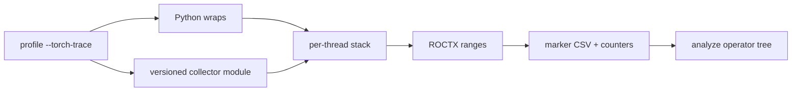
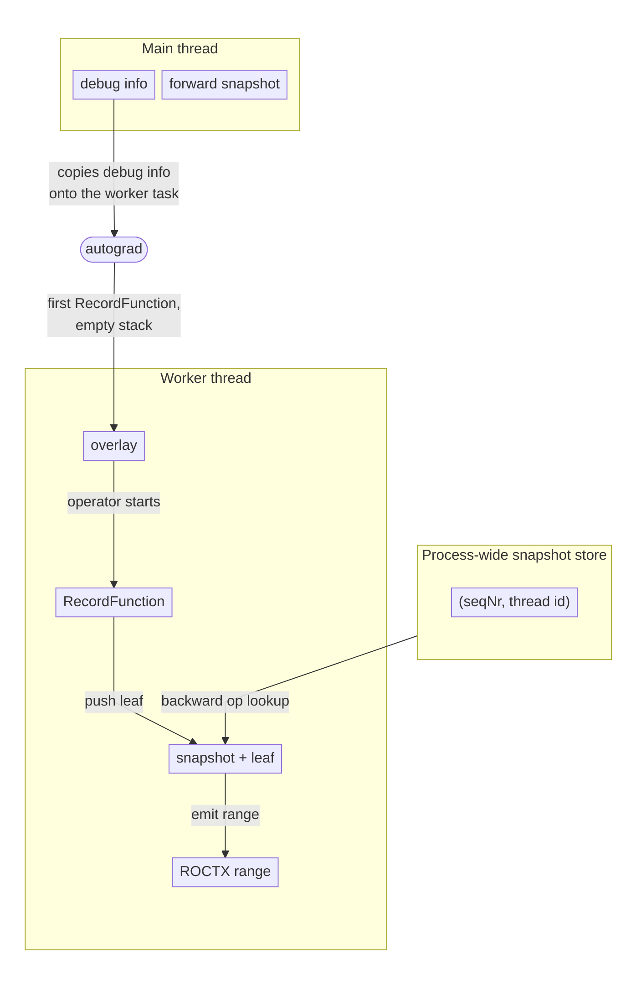

# Torch Trace Collector

## System Context

`--torch-trace` attributes GPU kernel counters to PyTorch operators.

- Profile records hardware counters per GPU kernel. Kernel names come from
  the device runtime. They do not name the operator that launched the work.
- `--torch-trace` emits ROCTX ranges around operators. Analyze joins those
  ranges to kernel counters (`--list-torch-operators`, `--torch-operator`).
- This HLD is the C++ `RecordFunction` collector that `--torch-trace` loads
  into the workload.

Surrounding pieces:

- Python wraps replace a Python API so each call pushes a named frame onto
  the per-thread stack and pops it on return. The frame includes a source
  location. Wraps run only on the Python thread. The wrap set does not
  change when the collector loads. With the collector, wrap frames share
  the collector stack; without it they go to the Python ROCTX path.
- Today `--torch-trace` wraps module forward, `Tensor.backward`,
  distributed collectives, optimizer step, tensor methods, compile, CUDA
  graphs, and similar entry points.
- `TorchDispatchMode` can emit ATen ranges on the Python thread only.
  Autograd workers run backward in C++ and never enter that context.
- RecordFunction runs on every thread that executes an op and sees the
  sequence numbers used to join backward ops to their forward calls.

Each thread holds a stack of frames (operator name and source context). On
each push the collector formats the full stack into one ROCTX range. The
profiler records those ranges for analyze.

**In scope:** operator ranges for PyTorch eager and autograd on every thread;
structural Python frames in the same hierarchy; Inductor kernels launched
through the static launcher; analyze join on the existing marker CSV.

**Out of scope:** non-Python workloads; PyTorch versions other than 2.13 and
2.14.

**Assumptions:**

- Autograd copies PyTorch per-thread debug info onto the worker task.
- Sequence number is the join key between a forward op and its backward op.

---

## Problem statement

- Counters are kernel-scoped. Users profiling PyTorch workloads cannot tell
  which operator produced a kernel.
- Python instrumentation is thread-local. `TorchDispatchMode` and structural
  wraps (`nn.Module`, `Tensor.backward`) run only on the Python thread.
  Autograd workers never see them, so backward kernels are unmarked or lack
  the forward operator chain.

---

## Requirements

What the system shall do:

- Nested ROCTX ranges around ATen operators on every thread that runs them,
  including autograd workers.
- A backward operator range includes the matching forward operator chain when
  PyTorch provides a sequence number.
- Python structural frames (`nn.Module`, `Tensor.backward`) appear in the
  same range as nested ATen ops.
- Marker strings remain compatible with existing analyze: split `Function`
  on `:#`; optional `|backend` moved to a `Backend` column.
- A workload PyTorch version with no matching collector module fails with a
  list of supported versions.

Non-functional:

- RecordFunction callbacks must not throw into PyTorch.
- The collector is a prebuilt module. Profile does not compile it.

---

## Design

Two producers share one per-thread stack. Each ROCTX range is the full stack.

### Decision 1: Where to hook ATen

| Option | Pros | Cons |
| --- | --- | --- |
| `TorchDispatchMode` only | Pure Python | Misses autograd workers |
| `RecordFunction` only | Every thread, sequence numbers | Does not name `nn.Module.forward` |
| **RecordFunction and wraps (chosen)** | **Workers, sequence numbers, module names** | Two producers to keep consistent |

- RecordFunction is a C++ hook. The collector is a module loaded into the
  workload interpreter.
- Python wraps push frames for entry points ATen does not name.
- When the collector is loaded, ATen ops use the callback only
  (`TorchDispatchMode` is off).
- If the module fails to load or install, profile falls back to
  `TorchDispatchMode` and warns.
- An unsupported PyTorch version is an error, not a fallback.
- This collector needs two wraps: module forward
  (`nn.Module.{Class}.forward`) and `Tensor.backward`.
- The rest of the wrap surface (System Context) is leftover from the
  Python tracer.
- Tensor methods often repeat an ATen op RecordFunction already names.
- Optimizer step, collectives, and compile are Python entry points
  RecordFunction does not name (`torch.distributed.all_reduce` is
  wrap-only).
- Whether to keep those wraps is an open question.

### Decision 2: How workers see Python scopes

- Worker RecordFunction sees ATen and autograd names
  (`evaluate_function`, `AddmmBackward0`). It does not see Python wraps
- The worker never runs those wraps, so debug info is how wrap frames
  reach it.
- Without that copy, worker ranges start at `evaluate_function` and omit
  `Tensor.backward`. Forward module and ATen names still appear from the
  snapshot.
- Python wraps store the live wrap stack in PyTorch's per-thread debug
  info.
- After forward returns, module wraps have popped, so when autograd
  queues the worker this is typically just `Tensor.backward`.
- Autograd copies that onto the worker. On the first op on an empty
  worker stack, those wrap frames are copied onto the worker stack.
- The forward snapshot is a separate process-wide snapshot store
  (Decision 3). It is not debug info.
- A snapshot is the entire stack at the forward op, keyed by sequence
  number and thread id.
- The forward thread pushes into that store. The backward thread reads
  (pops) from it.

| Step | From | Stack |
| --- | --- | --- |
| debug info | wrap stack on the main thread | **Tensor.backward** |
| forward snapshot | process-wide snapshot store (Decision 3) | **SimpleNet.forward / Linear.forward / aten::linear / aten::addmm** |
| overlay | debug info copied onto the worker | **Tensor.backward** |
| RecordFunction | worker callback | **Tensor.backward / evaluate_function: AddmmBackward0** |
| leaf | current op on the worker | **evaluate_function: AddmmBackward0 / AddmmBackward0** |
| snapshot + leaf | snapshot store + backward leaf | **… / SimpleNet.forward / Linear.forward / aten::linear / aten::addmm / AddmmBackward0** |
| ROCTX range | full worker stack | **Tensor.backward / evaluate_function: AddmmBackward0 / SimpleNet.forward / Linear.forward / aten::linear / aten::addmm / AddmmBackward0** |

- Debug info shares the wrap stack still live on the main thread. In this
  example that is `Tensor.backward`.
- It does not include `SimpleNet.forward` or `aten::addmm`; those frames
  have already left the stack.
- The worker has the current operator name (`evaluate_function`,
  `AddmmBackward0`) and gets the entire forward stack from the snapshot.
- The ROCTX range is those three pieces together.

### Decision 3: How backward joins forward

- A snapshot is the entire stack at a forward op with a sequence number.
- The forward thread pushes it under `(seqNr, thread id)` in a
  process-wide snapshot store.
- The backward thread reads (pops) the matching entry using the sequence
  number and the forward thread id PyTorch provides, and pushes frames it
  does not already have.
- Autograd does not copy this stack through debug info.
- Name matching is not used: several ops can share a name; seqNr is the
  ATen correlation id.

### Decision 4: How the C++ callback is shipped

| Option | Pros | Cons |
| --- | --- | --- |
| Compile at profile time | Matches any Torch | Slow first run; extra toolchain in the user env |
| Link into the native tool `.so` | One artifact | Wrong load path: the callback must live in the Python process |
| **Prebuilt `torch_trace_collector-<version>.so` (chosen)** | **No compile at profile time** | One artifact per supported Torch |

- Build finds Torch at `$ROCM_PATH/../torch`.
- The loader selects the artifact whose version matches the workload
  Torch version.

---

## Implementation
Details: `lld-torch-trace-collector.md`.

---

## Validation, security and debuggability

- gtest: snapshot store, wire format, leaf labels, scope balance, GPU
  forward/backward with ROCTX intercepted.
- Profile/analyze tests for `--torch-trace` output and operator listing.
- Collector stats: push/pop balance, snapshot hit rate, callback errors.
  RecordFunction callbacks must not throw into PyTorch; errors are counted
  instead.

---

## Open questions

| Item | Notes |
| --- | --- |
| Inductor static launcher | Those kernels launch without Triton's Python entry point, so they appear as torch ranges. Direct Triton launches are `--triton-trace`. |
| Python wrap surface | See System Context. Collectives, optimizer step, tensor methods, compile, and similar wraps are broader than module forward and `Tensor.backward`. Cleanup is separate from this collector. |
| Further Torch versions | Each new version needs a built artifact and a CMake version gate. |
| DispatchMode fallback | Unsupported version is fatal; other load failures fall back. Whether fallback should remain is not settled. |
