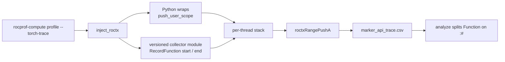
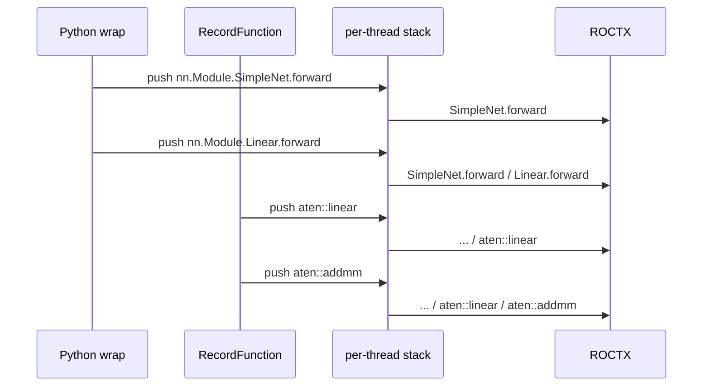

# LLD: torch_trace_collector

## Motivation

This document covers the implementation of torch operator attribution described
in `hld-torch-trace-collector.md`. User-facing behavior is in
`docs/how-to/profile/mode.rst` (`--torch-trace`).

---

## Data flow



- `inject_roctx` loads the versioned module and wraps Python entry points.
- Wraps call `push_user_scope` / `pop_user_scope`.
- ATen ops use the RecordFunction callback. `TorchDispatchMode` is off when
  the collector is loaded.
- Both paths share one per-thread stack. Each ROCTX range is the full stack.
- The wrap set does not change when the collector loads. Wrap frames go to
  the collector stack when it is loaded, and to the Python ROCTX path
  otherwise.
- An unsupported PyTorch version is an error. Other load/install failures
  fall back to `TorchDispatchMode` and warn.

Python API: `install`, `uninstall`, `push_user_scope`, `pop_user_scope`,
`dump_stats`.

---

## Python wraps

**Capture.** `nn.Module.__call__` is wrapped (not `forward()`, so hooks are
covered). On each call it records:

| Field | Value |
| --- | --- |
| Marker | `nn.Module.{ClassName}.forward` |
| Context | `#{n}@{file:line}` — call count on that instance, and the first caller outside the profiler and PyTorch |

`Tensor.backward` is the same pattern with marker `torch.Tensor.backward`.
Nested calls push nested frames. Exit pops the matching frame.

`--torch-trace` also wraps distributed collectives, optimizer step, tensor
methods, compile, CUDA graphs, and similar entry points. Those also call
`push_user_scope` when the collector is loaded. This collector needs module
forward and `Tensor.backward`; the rest is leftover from the Python tracer
(HLD open question). `torch.distributed.all_reduce` is wrap-only.

**Use.**

1. **Operator tree.** Later ATen ranges on that thread keep wrap frames as
   prefix, so analyze shows `SimpleNet.forward / Linear.forward / aten::addmm`
   instead of a bare `aten::addmm`.
2. **Autograd workers.** `push_user_scope` publishes the live wrap stack into
   PyTorch thread-local debug info. Autograd copies that onto the worker.
   After forward returns, module wraps have popped, so at `backward()` this
   is typically `Tensor.backward`. If the worker stack is empty at the first
   op, that chain is overlaid. Without the copy, worker ranges omit
   `Tensor.backward`.
3. **Forward–backward join.** The snapshot is the entire stack at the forward
   op (module frames plus ATen leaves), saved under `(seqNr, thread id)`.
   The matching backward op pops it. That is how `AddmmBackward0` includes
   `SimpleNet.forward / Linear.forward / aten::addmm`. It is not debug info.

`self.fc1(x)` in `tests/simple_net.py`:



`nn.Module.SimpleNet.forward` is only from the wrap. RecordFunction does not
emit it.

---

## Design

**Stack.** Frames are `(marker, context)`. `push_user_scope` publishes the
stack through PyTorch thread-local debug info. Autograd copies that onto the
worker task. Overlay runs only when the worker stack is empty at the first
op. Frames already present as a shared prefix are not pushed again.

**RecordFunction start.** Order on each start:

1. If the stack is empty, overlay debug info.
2. If the scope is `BACKWARD_FUNCTION` and `seqNr >= 0`, pop the snapshot
   keyed by `(seqNr, forwardThreadId)` and push missing frames.
3. Push the leaf (RecordFunction name plus default leaf context).
4. If the scope is `FUNCTION` and `seqNr >= 0`, save the stack under
   `(seqNr, current thread id)`.
5. Format the full stack and `roctxRangePushA`.

**Forward snapshot.** A snapshot is the entire stack at that forward op,
including the leaf just pushed. Name matching is not used.

**Wire format.** The string passed to ROCTX is:

```text
marker1/.../markerN:context1/.../contextN[|backend]
```

- Marker `%` and `/` are encoded as `%25` and `%2F`. Contexts are not encoded.
- RecordFunction ranges append `|torch`.
- User-scope ranges append `|<backend>` when `backend` is non-empty.
- Profile post-processing moves `|backend` into a `Backend` column.
  Unrecognized suffixes are tagged `unknown`.
- Analyze splits `Function` on `:#`.

**Leaf context:**

| When | Context |
| --- | --- |
| Forward, stack empty after overlay | `#1@aten:0` |
| Forward, stack non-empty after overlay | `#1@aten.nested:0` |
| Backward with `seqNr >= 0` | `#1@autograd.bwd:0` |
| Backward with no sequence number | `#1@autograd.engine:0` |

**Example.** `tests/simple_net.py`: `self.fc1(x)` then `loss.backward()`.

User scopes:

```text
nn.Module.SimpleNet.forward:#1@simple_net.py:50
nn.Module.SimpleNet.forward/nn.Module.Linear.forward:#1@simple_net.py:50/#1@simple_net.py:35
```

ATen leaf:

```text
nn.Module.SimpleNet.forward/nn.Module.Linear.forward/aten::linear/aten::addmm:#1@simple_net.py:50/#1@simple_net.py:35/#1@aten.nested:0/#1@aten.nested:0
```

Backward leaf on a worker thread:

```text
torch.Tensor.backward/autograd::engine::evaluate_function: AddmmBackward0/nn.Module.SimpleNet.forward/nn.Module.Linear.forward/aten::linear/aten::addmm/AddmmBackward0:#1@simple_net.py:52/#1@aten.nested:0/#1@simple_net.py:50/#1@simple_net.py:35/#1@aten.nested:0/#1@aten.nested:0/#1@autograd.bwd:0
```

- `torch.Tensor.backward` is the launcher wrap, from debug info.
- `evaluate_function` and `AddmmBackward0` are RecordFunction names on the
  worker.
- `SimpleNet.forward / Linear.forward / aten::linear / aten::addmm` is the
  snapshot.

**Errors.** RecordFunction callbacks increment `callback_errors` and do not
propagate exceptions. `push_user_scope` rolls back and re-raises.

---

## Build and load

- `BUILD_TORCH_TRACE_COLLECTOR` is `AUTO` (skip if unavailable), `ON`
  (require), or `OFF`.
- Torch is loaded from `$ROCM_PATH/../torch`. Supported versions are 2.13
  and 2.14.
- The module requires Python 3 development headers.
- The artifact is `torch_trace_collector-<version>.so` under
  `<libdir>/rocprofiler-compute/`.
- The loader selects the file whose version matches the workload
  `torch.__version__` with a local `+...` suffix removed.

---

## Validation

- gtest: snapshot store, wire round-trip, leaf labels, install/uninstall,
  scope balance, GPU forward/backward (ROCTX intercepted).
- Profile/analyze tests for `--torch-trace` output and operator listing.
- `dump_stats()`: push/pop balance, snapshot hit rate, callback errors.

## Limitations

- Inductor kernels launched through the static launcher appear as torch
  ranges (they do not go through Triton's Python entry point). Direct
  Triton launches are `--triton-trace`.
- Python wraps run only on the Python thread. Worker wrap names come from
  debug info overlay and the snapshot, not from running the wraps on the
  worker.
