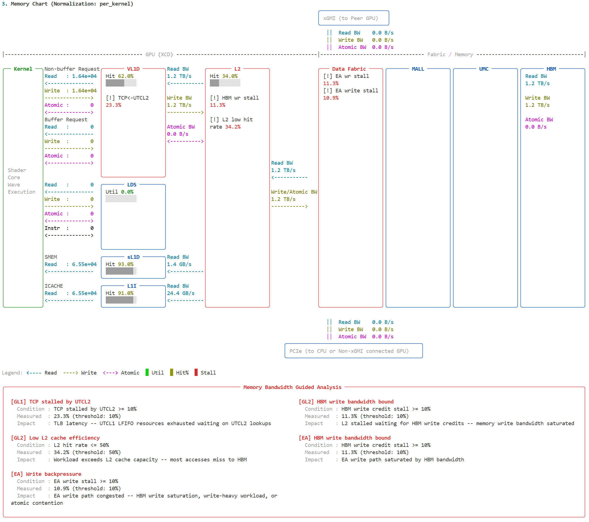
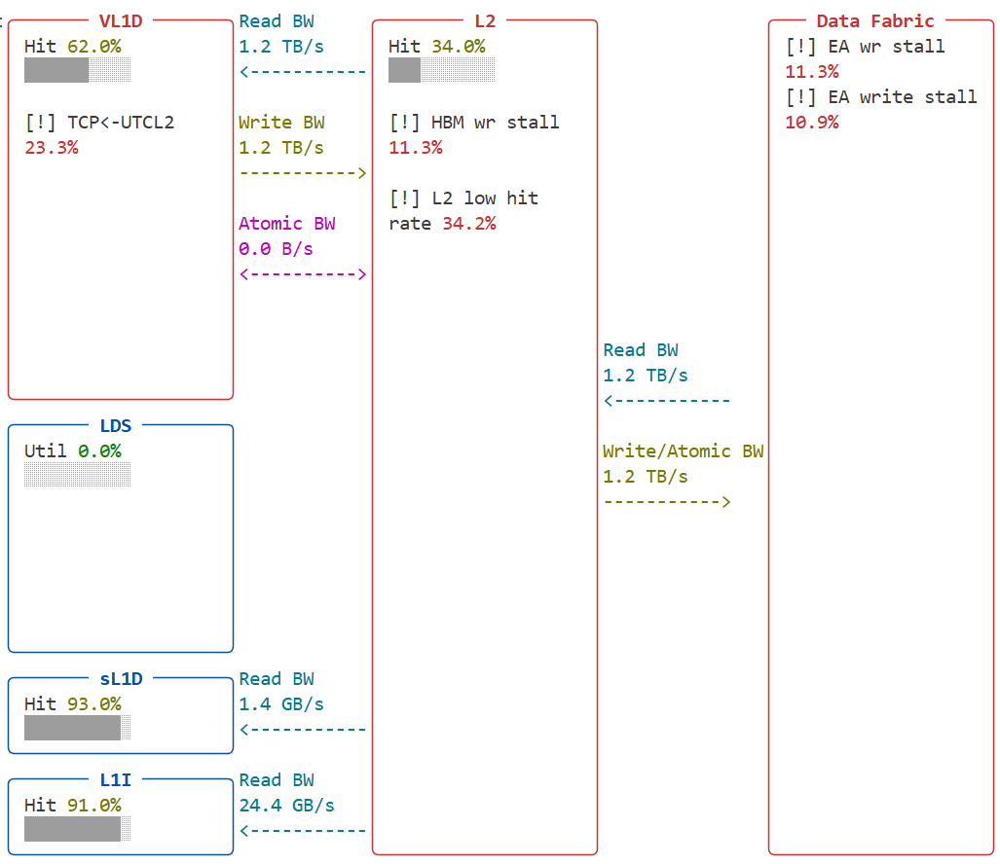
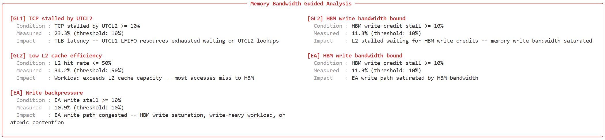

.. meta::
   :description: ROCm Compute Profiler: using Memory Bandwidth Analysis
   :keywords: ROCm Compute Profiler, Memory Bandwidth Analysis,
              guided analysis, bottleneck detection

************************************************************
Using Memory Bandwidth Analysis in ROCm Compute Profiler
************************************************************

.. warning::

   Memory Bandwidth Analysis is an experimental feature. Enable it by
   passing ``--experimental --membw-analysis`` in both ``profile`` and
   ``analyze`` modes. This feature is in its preliminary stages —
   guidance text will be refined in future releases. Behavior and
   command-line surface may change.

Memory Bandwidth Analysis identifies bottlenecks in the GPU memory
subsystem. It evaluates stall metrics collected from the
:doc:`L1 cache (GL1) </conceptual/cdna/vector-l1-cache>`,
:doc:`L2 cache (GL2) </conceptual/cdna/l2-cache>`, and Efficiency
Arbiter (EA) levels, then reports which components are under pressure
and why.

When bottlenecks are detected, the analysis overlays stall annotations
on the memory chart and renders a guidance panel below it with
per-bottleneck details.

Supported hardware
==================

Memory Bandwidth Analysis is currently available for:

* AMD Instinct MI350 Series (gfx950)

Profiling
=========

Collect memory bandwidth counters by adding ``--membw-analysis`` to
the ``profile`` command. This enables block 30, which contains the
stall and pressure metrics used by the analysis.

.. code-block:: shell

   $ rocprof-compute profile --experimental --membw-analysis -n my_workload -- ./my_app

Block 30 counters are collected alongside the standard profiling
counters. No other profiling options are needed.

Analysis
========

Run the analysis with ``--membw-analysis`` to enable bottleneck
detection and the guidance overlay:

.. code-block:: shell

   $ rocprof-compute analyze --experimental --membw-analysis -p workloads/my_workload/MI350/

To view only the memory chart and Memory Bandwidth Analysis tables,
use the block filter:

.. code-block:: shell

   $ rocprof-compute analyze --experimental --membw-analysis -p workloads/my_workload/MI350/ -b 3 30

Here, ``-b 3`` selects the memory chart and ``-b 30`` includes the
Memory Bandwidth Analysis tables.

Reading the output
==================

When active bottlenecks are found, the output includes:

Stall annotations on the memory chart
--------------------------------------

Active bottlenecks appear as ``[!]`` rows inside the affected cache
panel, showing the metric label and its measured value. Panels with
active stalls are highlighted with a red border, and a "Stall" entry
is added to the chart legend.

Guidance panel
--------------

A guidance panel appears below the memory chart. Each entry describes
one bottleneck:

* **Condition**: what was checked (for example,
  "TCP stalled by UTCL1 >= 10%")
* **Measured**: the actual value from the profiled workload and the
  threshold it was compared against
* **Impact**: a brief explanation of what this stall means for your
  workload

When no bottlenecks are found, a single status line is shown instead
(for example, "Memory Bandwidth Analysis: No bottlenecks detected").

Understanding the results
=========================

The analysis checks three levels of the memory hierarchy:

* **GL1 (L1 cache)**: stall sources within the L1 cache — address
  translation (UTCL1/UTCL2), texture data return (TD), L2
  backpressure, and shader core pressure (VMEM).
* **GL2 (L2 cache)**: HBM bandwidth pressure (read, write, or
  balanced), internal resource exhaustion (latency and source FIFOs),
  cache efficiency, and remote access (GMI).
* **EA (Efficiency Arbiter)**: HBM bandwidth at the memory controller
  level, GMI and PCIe path pressure, write backpressure, and atomic
  contention.

A bottleneck is reported when a stall metric exceeds its threshold
(typically 10% of busy time). When a parent metric exceeds the
threshold but no specific child does, a "balanced" or "other" entry
explains that the pressure is distributed rather than concentrated in
one path.

.. note::

   All Memory Bandwidth Analysis metrics are stall-cycle ratios (for
   example, ``100 * SUM(stall_cycles) / SUM(busy_cycles)``). These
   percentages are not affected by the normalization mode shown in the
   memory chart title (per_kernel, per_wave, etc.).

.. note::

   The guidance text is preliminary and will be improved in future
   releases. Use it as a starting point for investigation, not as a
   definitive diagnosis.

Further resources
=================

For deeper analysis beyond the guided output:

* **Block 30 raw metrics**: run ``-b 30`` to see the full set of
  Memory Bandwidth Analysis metric tables (L1 cache, L2 bottleneck
  indicators, EA indicators).
* **Memory chart**: the :doc:`CLI analysis documentation </how-to/analyze/cli>`
  covers the memory chart layout in detail.
* **CDNA performance model**: the :doc:`L2 cache
  </conceptual/cdna/l2-cache>` and :doc:`Vector L1 cache
  </conceptual/cdna/vector-l1-cache>` conceptual pages describe the
  cache hierarchy and how data moves through it.

Terminal width
==============

The memory chart requires a terminal width of at least **240 columns**
to display properly. The guidance panel matches the chart width.
Narrower terminals will cause line wrapping that reduces readability.

Check your terminal width with:

.. code-block:: shell

   $ tput cols

Limitations
===========

* Only AMD Instinct MI350 Series (gfx950) is supported. Other
  architectures will be added in future releases.
* Guidance text is in its preliminary stages and may not cover all
  bottleneck scenarios.
* The analysis evaluates per-dispatch averages. Bottlenecks that occur
  in only a subset of dispatches may not be visible.
